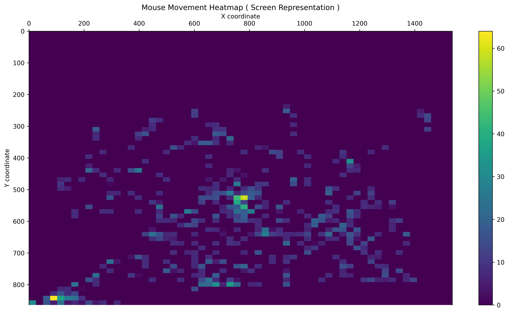
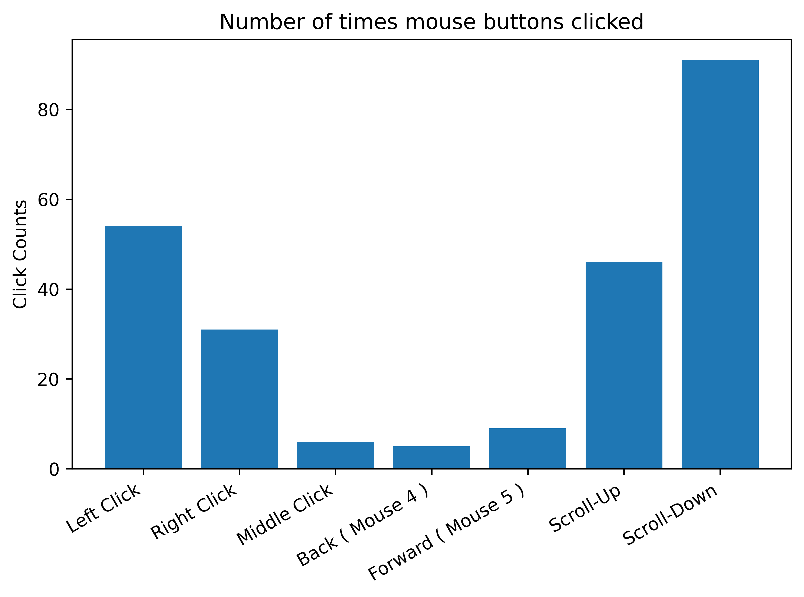

# mouse-c-py

> [!WARNING]
> This is a "*semi-failed*" project.
>
> It does work but "*we*" could not complete it because it requires so much in-depth knowledge our how the 'Win32' API works.

**Mouse logger** that generates a heatmap based on the position of your mouse on the screen and bar-chart for number of button clicks.

- Mouse Coordinates Heatmap:



- Mouse Button Clicks Bar Chart:



It uses Raw Input to be able to get the data from the *input* device itself and uses `GetCursorPos` to get the actual coordinates of where the **cursor** is located on the screen and also the number of button clicks on the mouse.

> This is my first ever project that has 2 programming language involved!

---

> [!WARNING]
> This project is still in development!
> 
> Please do take a look at the **branches** and switch to them accordingly.
> 
> I will add all the files to the `main` branch after the project has been completed entirely. For now, please switch branches to see the actual code!

Originally, I wanted to make this with Python, which  means that it was going to be **cross-platform** and everything.

But given that I had done all the labsheets for my 'Operating Systems' module. I decided that I would do the *logging* part in C as I want to still keep on working with C and I want to get more into low-level programming.

> Even though I don't really know C. I just like the philosophy of it whereby we have to do everything ourselves similar to Arch Linux!

Initially, everything was making sense! But when it was time to actually do the '*raw input*' part... Man this shit was difficult!

> [!NOTE]
> **The use of AI - Claude in this project!**
> 
> I personally hate things like Vibe Coding and similar things.
>
> Compared to my friends, I enjoy the process of coding... But mainly typing!
> 
> But given the situation that I am in, whereby, I only know the basics of the basics of C. I wanted a tutorial or a guide of some sort.
>
> Therefore, I decided to you one of the best Large Language Model for this *learning endeavour*; Claude!
>
> Basically, it pretty much did everything... "*But that's vibe coding*", I hear you say. Yes, but to conteract that. I tried to go in-depth ( like I usually do ) by looking at the shitty Windows documentation and also took a lot of notes!
> 
> To be honest with you if you tell me to explain you something... I won't be able to!
> 
> This is because I took my sweet time to make this initial version. As I am currently in Year 2 of UNI and because shit's hard. I did not really put much focus in this.
> 

> [!NOTE]
> **Conquering My Fear**
> 
> For every project until now, I went and followed lots of tutorial, made lots of notes and also during the development of the project... I take even more notes!
> 
> > This is complete bullshit!
> 
> Am I actually writing code or faking the "writing code"? Therefore, for the Python part. I just learned the things that I needed to learn and did not go in-depth per-se.
> 
> I did not even relied heavily on Claude ( *like one should do* ).
> 
> I hope that, by allowing myself to **fail** and **make** mistakes... I will become better, slowly but surely!

Nevertheless, I have to start somewhere and I decided that I wanted to do this project - which became a full on project as I it was **different** from POSIX systems.

> Obviously!

---

# Requirements for usage

If you are a **non-technical** person and simply wants to run the program right now.

> You are in good place!

## Version 0.1.0

- Simply place both the `program.exe` and `graphs.exe` executable file in the **same** folder
- Run / Double-click on the `program.exe` file and *use your mouse*
- After about 1 minute, you should see `program.exe` closes
- The `.png` files should appear in your `Downloads` folder

> [!WARNING]
> I know that if you don't use **OneDrive** and whereby your `Downloads` folder is found at the *root* directory ( *i.e, `C:\Users\username`* ) that the program is going to work!
> 
> But if you use `OneDrive` and you have your `OneDrive/Downloads` folder inside the `OneDrive` folder... Then there might be a problem.
> 
> This happens due to the fact that we uses `os.path.expanduser('~/Downloads')` which simply expands to `C:\Users\username\Downloads`

> [!TIP] The Temporary Fix
> 
> Simply go ahead and create a temporary `Downloads` folder at you root directory!

---

# Requirements for development

- Windows Machine ( Preferably Windows 11 )
- MYSYS: GCC and Make
- Python ( Version 3.14.2 and above )
- `pip` or `uv` ( *I know I should switch to `uv`* )

## Version 0.1.0

> Please switch to the `v0.1.0` branch [here](https://github.com/Sunhaloo/mouse-c-py/tree/v0.1.0).

- `main.c`:
	- Single file that does the logging of the mouse coordinates and buttons
	- Uses raw-input to get the data from the mouse
	- Uses `GetCursorPos` to get the screen coordinates
	- Writes a `mouse_data.csv` file
	- Call the `graphs.exe` file to be able to create the graphs
- `main.py`:
	- Single file responsible for creating the heatmap and bar-chart using `matplotlib`, `pandas` and `numpy`
	- `pyinstaller` to be able to convert the `main.py` file into a single `graphs.exe` executable file
	- `graphs.exe` gets called from `main.c` / `program.exe` to be able to generate the graphs and save them to the `~/Downloads` folder!

### Testing

> I expect that I know the basics of creating the Python virtual environment and so!

- Create the `graphs.exe` file using `pyinstaller` with the following command:

```powershell
pyinstaller --onefile --name graphs main.py
```

Then simply place the resulting `graphs.exe` in the same folder as the the `main.c` file and compile and run using the provided `Makefile` with the `make` command.

Hence, you should see that we have our `mouse_data.csv` file and also or image(s) in our `~/Downloads` folder
