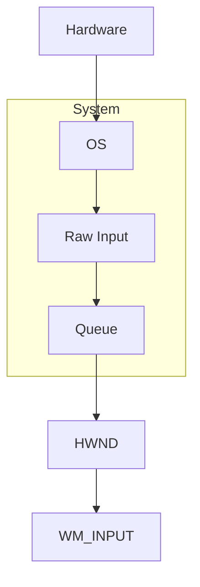

# Flushing!

```C
#include <stdio.h>
#include <string.h>
#include <windows.h>

// our main function
int main(int argc, char *argv[]) {
  char *tick_tock = "Tock";

  // iterate through the loop 5 times
  for (int i = 0; i < 5; i++) {
    // sleep the program for 1 second
    Sleep(1000);

    // display either 'Tick' or 'Tock'
    if (strcmp(tick_tock, "Tick") == 0) {
      tick_tock = "Tock";
    } else {
      tick_tock = "Tick";
    }

  printf("%s\n", tick_tock);

  }

  return 0;
```

When writing this code, Claude asked me if the output was **instant** or was it *sleeping* like its supposed to do...

The above code did run perfectly like the code indented.

But it told me something that I did **not** know about!

Using the `\n` character inside the `printf` function means that it automatically applies the `flush` function to it.

> Using `\n` means that `stdout` is **line buffered**!

> [!NOTE]
> Nevertheless, the code still *sleeps* perfectly fine even if I **remove** `\n` from the `printf` function.

> [!TIP]
> The `printf` function is similar to the `print` function found in Python ( *basically all `print` function comes from C's implementation I guess* ) whereby we obviously write to an ( *array* ) buffer first and then display on the screen!
> 
> > This is the main reason as to why Claude asked us this question!

# The `-lgdi32` Flag

This is a `gcc` flag that is we used to be able to compile things like *graphics* and *drawing* things on the screen like a **window**, **text** and other things!

Given that we are not going to be working with "*graphics*"; this means that, you **don't** need to add it to the `gcc` compilation command.

> Nevertheless, I would recommended you to add it because just for "*safety*"...

---

# From The 'Windows API For Hackers Video'

> Link to YouTube Video: https://www.youtube.com/watch?v=zqi2KE6RA38

## Common Data Types

> Official Windows Documentation: https://learn.microsoft.com/en-us/windows/win32/winprog/windows-data-types

- `HANDLE`:
	- To deal with *files*, *windows* and **devices**

> So from what I can understand we are going to be using this a lot!

- `HWND`:
	- Handle to a window $\rightarrow$ Basically the same thing as `HANDLE` just that we are instead handling actual *GUI* windows
- `HINSTANCE`:
	- Handle to an instance $\rightarrow$ Module handler
	- Identify the instance of an application / Dynamic Link Library ( DLL )
- `HMODULE`:
	- The `LoadLibrary` *function* is going to return data of **type** `HMODULE`
	- *Module* can be an **executable** or `.dll`
	- Same thing as `HINSTANCE` but specifically for *modules*
- `size_t`:
	- Basically the return value of `sizeof` function
	- Supposedly its and **unsigned** integer value
- `ULONG_PTR`:
	- **Unsigned** long pointer that is used for *precise pointers*
	- Stored the full width of a pointer
- `PVOID`:
	- A pointer to `void`
	- When we want to write generic function / APIs so that we can accept pointers to any kind of data
- `LPCVOID`:
	- Same thing as `PVOID` but in this case, its a **constant**
- `DWORD`:
	- 32-bit **unsigned** integers
	- Used a lot in the Windows API for flags, bit-fields and other general values
- `WORD`:
	- 16-bit **unsigned** integers
	- Used for smaller numerical values
- `BYTE`:
	- 8-big **unsigned** integers
	- Used for binary values, data and Boolean values
- `LPSTR`:
	- Pointer to a *null* terminated string of 8-bit of *Windows ANSI characters*
	- This means that we can change in at any point in time during program *run* **only** if actual **buffer** / **array** is on the stack / heap else not!
- `LPCSTR`:
	- Basically the same thing as `LPSTR` but instead we a `str`ing **constant**
- `LPWSTR`:
	- Pointer to a *null* terminated string of 16-bit **UNICODE** characters
	- Given that `ANSI` characters are eventually converted into `UNICODE`; better to use them as the start, I guess!
- `LPCTSTR`:
	- Pointer to **constant** *null* null terminated string of 16-bit **UNICODE** characters
- `LPCWSTR`:
	- Pointer to a *null* terminated string of 16-bit **UNICODE** characters
	- Same thing as `LPCSTR` but this time in **UNICODE**
- `LPARAM`:
	- Message parameter used in message handling functions
	- Accepts a pointer
- `WPARAM`:
	- Message parameter used in message handling functions
	- But in this case **unsigned**
- `UINT`:
	- **Unsigned** integer value
- `LONG`:
	- **Signed** 32-bit integer value
	- *Ouuhh*, used to specifying **coordinates**; which might be of value to us!

> For example and showing off purposes!

- Here is how we can use something like `ULONG_PTR`:

```C

  // declare variables and also find the address of variable
  int x = 100;
  int *x_ptr = &x;

  // get the precise address
  ULONG_PTR unlong_ptr = (ULONG_PTR)x_ptr;

  // display the "normal" and "precise" address
  printf("\nPointer For 'x': %p\n", x_ptr);
  printf("\nLong Precise Pointer: %p\n", (void *)unlong_ptr);

```

- Here is how we can use something like `LPSTR`:

```C

  // declare mutable string
  LPSTR str = "Hello World";

  printf("%s\n", str);

  str = "Very Nice";

  printf("%s\n", str);

```

## Create A File

> [!INFO] Resource(s)
> Windows File Header API: https://learn.microsoft.com/en-us/windows/win32/api/fileapi/
> `CreateFileW` Function: https://learn.microsoft.com/en-us/windows/win32/api/fileapi/nf-fileapi-createfilew
> `WriteFile` Function: https://learn.microsoft.com/en-us/windows/win32/api/fileapi/nf-fileapi-writefile

```C
#include <handleapi.h>
#include <stdio.h>
#include <string.h>
#include <windows.h>
#include <errhandlingapi.h>

// our main function
int main(int argc, char *argv[]) {
  // variable to hold the file name
  LPWSTR file_name = L"file_testing.txt";

  // create a file uisng the `CreateFileW` system call
  HANDLE file_handler = CreateFileW(
    file_name,
    (GENERIC_READ | GENERIC_WRITE),
    0,
    NULL,
    OPEN_ALWAYS,
    FILE_ATTRIBUTE_NORMAL,
    NULL
  );

  // actually use the system call
  if (file_handler == INVALID_HANDLE_VALUE) {
    printf("\nFailed To Open File! Error: %lu\n", GetLastError());

    return 1;
  }

  // write to the file

  // create the message to write to the file
  const char file_data[] = "Hello World In Windows Through Windows ( Win32) API";

  // number of bytes that we are going to write into our file
  DWORD num_of_bytes_written;

  // INFO: this is similar to the `write` system call in Linux / UNIX systems
  BOOL fileWriter = WriteFile(
    file_handler,
    file_data,
    strlen(file_data),
    &num_of_bytes_written,
    NULL
  );

  // check if we have successfully written data to the file
  if (!fileWriter) {
    printf("\nFailed To Write To File! Error: %lu\n", GetLastError());

    return 1;

  } else {
    wprintf(L"Written to file '%ls' successfully\n", file_name);
  }

  // close the file handler
  CloseHandle(file_handler);

  return 0;
}
```

> [!SUCCESS]
> We have completed watching the video and its time to move onto other things...
> 
> > I think it going to be time to actually start writing the main thing!

## Our Makefile

> Yes, I did install `make` on Windows through 'MYSYS'!

```make
program: compile run clean

compile:
	@gcc main.c -Wall -Wextra -lgdi32 -o program

run:
	@./program

clean:
	@del program.exe
```

# Windows Coordinate System

> [!INFO] Resource(s)
> - `POINT` Structure: https://learn.microsoft.com/en-us/windows/win32/api/windef/ns-windef-point
> - `GetCursorPos` Function: https://learn.microsoft.com/en-us/windows/win32/api/winuser/nf-winuser-getcursorpos
> - `QueryPerformanceFrequency`: https://learn.microsoft.com/en-us/windows/win32/api/profileapi/nf-profileapi-queryperformancefrequency
> - `QueryPerformanceCounter`: https://learn.microsoft.com/en-us/windows/win32/api/profileapi/nf-profileapi-queryperformancecounter

## Using Pointers To `POINT` Structure and `GetCursorPos` Function

### Side-Quest: Timing Things!

There are many ways to "*get time*" in C and because there are many ways... It get difficult to pick and choose what we should use!

Therefore, I spoke a little bit with [Gemini](https://gemini.google.com) about it and after chatting we it.

I decided to use `clock_gettime` function so that we get a *fast* and **precise** way to measure time.

> [!BUG]
> `clock_gettime` function is a function that is only present on **Linux** and **Posix** compliant machines!
> 
> There are no such things such as a `clock_gettime` function on Windows!

Therefore, we are going to have to use `QueryPerformanceFrequency` and `QueryPerformanceCounter`. Whereby with the *former*, we are going to ask the CPU at what **frequency** it works so as to get the *number of ticks* that makes up 1 second. While the *latter* is going to be the one that is going to be actually "*tracking*" the time!

### Actually Coding It!

#### Testing The `GetCursorPos` Function Only

```C
#include <stdio.h>
#include <windows.h>

// our `POINT` structure
POINT coordinates;


// our main function
int main(int argc, char *argv[]) {
  // call the `GetCursorPos` function to get the current coordindates of the mouse
  // TIP: simply pass the 'point' `coordinates` and then simply access via `coordinates.x` and `coordinates.y`
  // additionally, add to `if ... else ...` statement for error handling
  if (GetCursorPos(&coordinates)) {
    printf("\nx: %d, y: %d\n", coordinates.x, coordinates.y);
  } else {
    printf("\n Failed To Retrive Cursor Coordinates! Error: %lu", GetLastError());
  }

  return 0;
```

#### Adding Continuous Mouse Logging and Timer

```C
#include <profileapi.h>
#include <stdio.h>
#include <windows.h>
#include <winnt.h>

// our `POINT` structure
POINT coordinates;


// our main function
int main(int argc, char *argv[]) {
  // variable to keep the elapsed / remaining time
  double elapsed_time = 0;
  double total_time = 0;

  // declare variables for the timer
  LARGE_INTEGER frequency;
  LARGE_INTEGER start, current;

  // get the number of ticks that makes up one second from CPU
  QueryPerformanceFrequency(&frequency);

  // get the actual time stamp for the start time
  QueryPerformanceCounter(&start);

  while (1) {
    // get the actual time stamp for the current time
    QueryPerformanceCounter(&current);

    // calculate the elapsed time
    elapsed_time = (double)(current.QuadPart - start.QuadPart) / frequency.QuadPart;

    // get the cursor's position
    if (GetCursorPos(&coordinates)) {
      printf("x: %ld, y: %ld, elapsed time: %0.2lf\n", coordinates.x, coordinates.y, elapsed_time);
    } else {
      printf("\n Failed To Retrive Cursor Coordinates! Error: %lu", GetLastError());
    }

    // check if the time to "leave" has been reached!
    if (elapsed_time >= 10.0) {
      // `exit` the program ( in this case ) instead of a `break`
      exit(0);
    }

    // sleep the program every 500 mili-seconds so that use can see output on console clearly
    Sleep(500);
  }

  return 0;
}
```

---

# Windows Raw Input

> [!INFO] Resource(s)
> - About Raw Input ( Windows Documentation ): https://learn.microsoft.com/en-us/windows/win32/inputdev/about-raw-input

> Ohh, 'HIDs' is basically the acronym for 'Human Interface Devices'!

> [!INFO] **Advantages** of 'Raw Input'
> 
> > From the official documentation...
> 
> - An application does not have to detect or open the input device.
> - An application gets the data directly from the device, and processes the data for its needs.
> - An application can distinguish the source of the input even if it is from the same type of device. For example, two mouse devices.
> - An application manages the data traffic by specifying data from a collection of devices or only specific device types.
> - HID devices can be used as they become available in the marketplace, without waiting for new message types or an updated OS to have new commands in `WM_APPCOMMAND`.

> [!WARNING] Something To Note About
> [`WM_APPCOMMAND`](https://learn.microsoft.com/en-us/windows/win32/inputdev/wm-appcommand) does provide for some HID devices.
> 
> However, `WM_APPCOMMAND` is a **higher** level device-independent input event, while [`WM_INPUT`](https://learn.microsoft.com/en-us/windows/win32/inputdev/wm-input) sends *raw*, **low** level data that is specific to a device.

## How To Raw Input

1. No applications receives raw data from devices... Need to **first** *register* the device
2. Create array of [`RAWINPUTDEVICE`](https://learn.microsoft.com/en-us/windows/win32/api/winuser/ns-winuser-rawinputdevice) `struct`ure
3. Then after registration, application calls [`RegisterRawInputDevices`](https://learn.microsoft.com/en-us/windows/win32/api/winuser/nf-winuser-registerrawinputdevices) function
4. Read the data coming from 'Raw Input'

> [!TIP]
> An application **can** *register* a device that is **not** currently plugged into the computer system.
> 
> Then when the device gets **attached** / plugged-in; Windows ( Driver ) Manager is going to do its thing!

Some / Most new games has a toggle that allows the user to switch between **using** 'Raw Input' or turning it **off**.

This is basically a *switch* that the developers / programmer can implement in their program from passing *flags* to `RAWINPUTDEVICE`.

## Hidden Windows!

> [!INFO] Resource(s)
> - `CreateWindowExA`: https://learn.microsoft.com/en-us/windows/win32/api/winuser/nf-winuser-createwindowexa

Talking with [Claude](https://claude.ai), I see that to be able to use `WM_INPUT`. We are going to have to create a **window** because `WM_INPUT` passes *messages* through these windows.

Hence, given that we just need to get the raw data from the mouse and don't really need an actual 'GUI' window... We need to create a hidden window do that the *data* can **communicate**.

The *window* is **required** as `WL_INPUT` is part of the 'Win32' **message loop system** and look something like this:



> [!INFO]
> The thing that we are actually requiring is a "**message queue tie to a thread**".
> 
> This is why we need that **hidden window** to be able to communicate through that thread.

---

Now Claude gave me this and it's saying that this is basically the entire program ( skeleton )!

```console
1. Create a hidden window
        ↓
2. Register mouse as Raw Input device
        ↓
3. Start message loop (waiting for WM_INPUT)
        ↓
4. Each time mouse moves/clicked → WM_INPUT fires
        ↓
5. We extract x, y, buttons from the raw data
        ↓
6. Write to CSV
        ↓
7. Timer runs out → close window → program exits
```

---

### How To Keep Waiting For Messages and Keep Timer Running?

> [!INFO] Resource(s)
> - `PeekMessage`: https://learn.microsoft.com/en-us/windows/win32/api/winuser/nf-winuser-peekmessagea

- **Cannot** use `fork` as its Linux only
- `p_threads` are available in 'MingW' but are **not** native as they are emulated
	- I mean Windows does have Windows specific threads!

The answer is more simple than *forking* or making our program multi-threaded. Instead we simply just need to do something like this and use a function calls `PeekMessage`.

> Claude did gave me this answer!

```console
while (timer hasn't expired) {
    PeekMessage → if there's a WM_INPUT, handle it
    check timer
    update CSV
}
```

> [!NOTE]
> It has something to do with *blocking* and from what I can understand `PeekMessage` function is **non-blocking**!

### Peek Message Function

> [!INFO] Resource(s)
> 
> - `PeekMessagew`: https://learn.microsoft.com/en-us/windows/win32/api/winuser/nf-winuser-peekmessagew

From the documentation I see that it simply checks for any thread messages that are being received.

> It will return a `BOOL` value!

Additionally, here is a little snippet of code, that I don't understand at all, from Nick Walton's code:

```C
while (!quit) {
    static MSG message = { 0 };
    
    // Process Windows messages
    while (PeekMessage(&message, NULL, 0, 0, PM_REMOVE)) {
        DispatchMessage(&message);
    }

    static int keyboard_x = 0, keyboard_y = 0;

    // Movement Input
    if (keyboard[VK_RIGHT] || keyboard['D']) ++keyboard_x;
    if (keyboard[VK_LEFT]  || keyboard['A']) --keyboard_x;
    if (keyboard[VK_UP]    || keyboard['W']) ++keyboard_y;
    if (keyboard[VK_DOWN]  || keyboard['S']) --keyboard_y;

    // Boundary Checks (Clamping)
    if (keyboard_x < 0)            keyboard_x = 0;
    if (keyboard_x > frame.w - 1)  keyboard_x = frame.w - 1;
    if (keyboard_y < 0)            keyboard_y = 0;
    if (keyboard_y > frame.h - 1)  keyboard_y = frame.h - 1;

    // Visual Effects
    // 1. Draw 1000 random black pixels (noise)
    for (int i = 0; i < 1000; ++i) {
        frame.pixels[rand32() % (frame.w * frame.h)] = 0;
    }

    // 2. Draw white pixel at keyboard position
    frame.pixels[keyboard_x + keyboard_y * frame.w] = 0x00ffffff;

    // 3. Draw white pixel at mouse position if left-clicked
    if (mouse.buttons & MOUSE_LEFT) {
        frame.pixels[mouse.x + mouse.y * frame.w] = 0x00ffffff;
    }

    // Trigger window redraw
    InvalidateRect(window_handle, NULL, FALSE);
    UpdateWindow(window_handle);
}
```

Where I see that the `PeekMessagew` function itself is found **inside** a `while` loop that keeps on checking for the received messages.

The above code snippet was inside a `WinMain` function. But we are not interested in making an actual window now!

Additionally, we know that as `PeekMessage` is non-blocking making it the ideal thing for us!

---

# Defining And Creating A Hidden Window

> [!INFO] Resource(s)
> 
> - `tagWNDCLASSEXA`: https://learn.microsoft.com/en-us/windows/win32/api/winuser/ns-winuser-wndclassexa
> - `DefWindowProcW`: https://learn.microsoft.com/en-us/windows/win32/api/winuser/nf-winuser-defwindowprocw
> - `WNDCLASSEXW`: https://learn.microsoft.com/en-us/windows/win32/api/winuser/ns-winuser-wndclassexw
> - `RegisterClassExW`: https://learn.microsoft.com/en-us/windows/win32/api/winuser/nf-winuser-registerclassexw
> - `CreateWindowExW`: https://learn.microsoft.com/en-us/windows/win32/api/winuser/nf-winuser-createwindowexw
> - `RAWINPUTDEVICE`: https://learn.microsoft.com/en-us/windows/win32/api/winuser/ns-winuser-rawinputdevice
> - `RegisterRawInputDevices`: https://learn.microsoft.com/en-us/windows/win32/api/winuser/nf-winuser-registerrawinputdevices

## Create Callback Function To Handle Messages

> Created the following code with the help of ChatGPT

> [!BUG] I know nothing!
> 
> Yes, I know nothing about this shit and I just want to make something...
> 
> Therefore, you could say that I am following a tutorial from these large language models!

```C
// function to handle all non-raw-input message
LRESULT CALLBACK WindowProc(HWND hwnd, UINT msg, WPARAM wParam, LPARAM lParam) {
  // using `switch ... case` as it the standard and is natural for working with 'Win32'
  // additionally, given how 'Win32' was built --> make sense to use `switch ... case`
  // so that the readability improves compared to using `if ... else` statements
  switch(msg) {
    // if the incoming message is under the category of "raw-input"
    case WM_INPUT:
      printf("Raw Input Message Detected!\n");

      // NOTE: `return 0` so that we confirm that we handle this message
      return 0;

    // for all the other message; let `DefWindowProcW` handle it for us
    default:
      return DefWindowProcW(hwnd, msg, wParam, lParam);
  }
}
```

> [!TIP] Where does these `DefWindowProcW` parameters comes from?
> 
> > [!NOTE]
> > This answer is from Claude!
> 
> ```C
> // code snippet from Nick Walton!
> while (PeekMessage(&message, NULL, 0, 0, PM_REMOVE)) {
>     DispatchMessage(&message);
> }
> ```
> 
> `DispatchMessage` is the answer. When you call `DispatchMessage`, Windows looks at the message, figures out which window it belongs to, and then **calls your `WindowProc` function directly** passing in those four parameters automatically.
> 
> So the chain is:
> 
> ```
> PeekMessage → finds a message
>     ↓
> DispatchMessage → calls WindowProc for you
>     ↓
> WindowProc → you handle it
> ```

## Registration Of ( GUI ) Windows

### Create Structure Holding Hidden Window Info

```C
// structure that contains information for our hidden window
// NOTE: this global structure is defined at the top
// who would have fucking thought!
WNDCLASSEXW HiddenWindowClass;

// our main function
int main(int argc, char *argv[]) {
  // initialize `HiddenWindowClass` at runtime
  // INFO: doing it in this way to avoid declaration errors
  HiddenWindowClass.cbSize        = sizeof(WNDCLASSEXW);
  HiddenWindowClass.lpfnWndProc   = WindowProc;
  HiddenWindowClass.hInstance     = GetModuleHandleW(NULL);
  HiddenWindowClass.lpszClassName = L"RawInputWindow";

  // actually register the window class for subsequent use
  if (!RegisterClassExW(&HiddenWindowClass)) {
      printf("Failed to register window class! Error: %lu\n", GetLastError());
      return 1;
  }

  return 0;
}
```

## Create The Hidden Window

To create the hidden window, we just to update `main` so that we use the `CreateWindowExW` function to create the window and by passing *correct* parameters... We should be able to make it hidden

> For more information about the function; please refer to the link in the resources section found above ( for this heading )!

```C
// global handle to our hidden window
// again, this is found at the top of our file
HWND hwnd;

// here is our updated `main` function

// our main function
int main(int argc, char *argv[]) {
  // initialize `HiddenWindowClass` at runtime
  // INFO: doing it in this way to avoid declaration errors
  HiddenWindowClass.cbSize        = sizeof(WNDCLASSEXW);
  HiddenWindowClass.lpfnWndProc   = WindowProc;
  HiddenWindowClass.hInstance     = GetModuleHandleW(NULL);
  HiddenWindowClass.lpszClassName = L"RawInputWindow";

  // actually register the window class for subsequent use
  if (!RegisterClassExW(&HiddenWindowClass)) {
      printf("Failed to register window class! Error: %lu\n", GetLastError());
      return 1;
  }

  // create a window ==> pass "correct" parameters to make it hidden
  hwnd = CreateWindowExW(
      0,
      L"RawInputWindow",
      L"",
      0,
      0,
      0,
      0,
      0,
      HWND_MESSAGE,
      NULL,
      GetModuleHandleW(NULL),
      NULL
  );

  // check if window creation is successfull or not
  if (hwnd == NULL) {
      printf("Failed to create window! Error: %lu\n", GetLastError());
      return 1;
  }

  return 0;
}
```

## Registration Of Raw Input Devices

We are now going to configure the `RAWINPUTDEVICE` `struct`ure so that we are able to register actual devices to the window that we created above!

> From the documentation, here it how the structure looks like:

```C
typedef struct tagRAWINPUTDEVICE {
  USHORT usUsagePage;
  USHORT usUsage;
  DWORD  dwFlags;
  HWND   hwndTarget;
} RAWINPUTDEVICE, *PRAWINPUTDEVICE, *LPRAWINPUTDEVICE;
```

We are interested in `usUsagePage` ( *for generic desktop device* ) and also `usUsage` ( *specifically need to be set for the mouse* ).

From the documentation, I see that `usUsagePage` is going to accept a top-level collection which is:

> "a grouping of functionality that targets a particular software consumer (or type of consumer) of the functionality. For example, a top-level collection can be described as keyboard, mouse, consumer control, sensor, display, and so on" [top-level-collections](https://learn.microsoft.com/en-us/windows-hardware/drivers/hid/top-level-collections)

For the `dwFlags`, as we need our program to have this flow:

```console
User clicks on a game -> our program loses focus -> we STILL receive mouse data
```

Therefore, if you go and take a look at the documentation, you are going to see `RIDEV_INPUTSINK` and it says that:

> "If set, this enables the caller to receive the input even when the caller is not in the foreground. Note that `hwndTarget` must be specified."

And for the `hwndTarget` its the above `hwnd` - `CreateWindowExW` window that we should supply it with!

```C
// raw input device registration structure
// again, this is found at the top of our file
RAWINPUTDEVICE rid;

// I am now only going to show you part of the inside
// of the main function

// our main function
int main(int argc, char *argv[]) {

  // other codes found here

  // check if window creation is successfull or not
  if (hwnd == NULL) {
      printf("Failed to create window! Error: %lu\n", GetLastError());
      return 1;
  }

  // configure the raw input device structure to target mouse input
  rid.usUsagePage = HID_USAGE_PAGE_GENERIC;
  rid.usUsage     = HID_USAGE_GENERIC_MOUSE;
  rid.dwFlags     = RIDEV_INPUTSINK;
  rid.hwndTarget  = hwnd;

  return 0;
}
```

### Actually Register The Devices

Now, we are going to use the `RegisterRawInputDevices` to actually register the devices that *supplies* "raw" data.

```C
// our main function
int main(int argc, char *argv[]) {
  // initialize `HiddenWindowClass` at runtime
  // INFO: doing it in this way to avoid declaration errors
  HiddenWindowClass.cbSize        = sizeof(WNDCLASSEXW);
  HiddenWindowClass.lpfnWndProc   = WindowProc;
  HiddenWindowClass.hInstance     = GetModuleHandleW(NULL);
  HiddenWindowClass.lpszClassName = L"RawInputWindow";

  // actually register the window class for subsequent use
  if (!RegisterClassExW(&HiddenWindowClass)) {
      printf("Failed to register window class! Error: %lu\n", GetLastError());
      return 1;
  }

  // create a window ==> pass "correct" parameters to make it hidden
  hwnd = CreateWindowExW(
      0,
      L"RawInputWindow",
      L"",
      0,
      0,
      0,
      0,
      0,
      HWND_MESSAGE,
      NULL,
      GetModuleHandleW(NULL),
      NULL
  );

  // check if window creation is successfull or not
  if (hwnd == NULL) {
      printf("Failed to create window! Error: %lu\n", GetLastError());
      return 1;
  }

  // configure the raw input device structure to target mouse input
  rid.usUsagePage = HID_USAGE_PAGE_GENERIC;
  rid.usUsage     = HID_USAGE_GENERIC_MOUSE;
  rid.dwFlags     = RIDEV_INPUTSINK;
  rid.hwndTarget  = hwnd;

  // actually register the raw input devices ( in our case mouse devices )
  // NOTE: pass the struct, the number of devies to register and size of struct
  if (!RegisterRawInputDevices(&rid, 1, sizeof(RAWINPUTDEVICE))) {
      printf("Failed to register raw input device! Error: %lu\n", GetLastError());
      return 1;
  }

  return 0;
}
```

### Message Loop - For Information Passing And Processing

We are now going to add this little snippet of code:

```C
MSG message = {0};

while (1) {
    while (PeekMessageW(&message, hwnd, 0, 0, PM_REMOVE)) {
        DispatchMessageW(&message);
    }
```

The above code is also found in Nick Walton's code ( *which was the main inspiration for this project* )!

> Link To Blog: https://croakingkero.com/tutorials/input_win32/

Therefore, we are going to add the above line so that we are able to *get* the "raw-input" *enabled* devices **data** and therefore use that data from the **hidden** window for processing.

## Great Success

> You could say that this is a milestone!

Here is the full code that allow us to see / get the data from a "raw-input" enabled device and our hidden window then processes the data!

```C
#include <stdio.h>
#include <windows.h>
#include <hidusage.h>


// global handle to our hidden window
HWND hwnd;

// forward declaration of WindowProc
LRESULT CALLBACK WindowProc(HWND hwnd, UINT msg, WPARAM wParam, LPARAM lParam);

// structure that contains information for our hidden window
WNDCLASSEXW HiddenWindowClass;

// raw input device registration structure
RAWINPUTDEVICE rid;

// function to handle all non-raw-input message
LRESULT CALLBACK WindowProc(HWND hwnd, UINT msg, WPARAM wParam, LPARAM lParam) {
  // using `switch ... case` as it the standard and is natural for working with 'Win32'
  // additionally, given how 'Win32' was built --> make sense to use `switch ... case`
  // so that the readability improves compared to using `if ... else` statements
  switch(msg) {
    // if the incoming message is under the category of "raw-input"
    case WM_INPUT:
      printf("Raw Input Message Detected!\n");

      // NOTE: `return 0` so that we confirm that we handle this message
      return 0;

    // for all the other message; let `DefWindowProcW` handle it for us
    default:
      return DefWindowProcW(hwnd, msg, wParam, lParam);
  }
}

// our main function
int main(int argc, char *argv[]) {
  // initialize `HiddenWindowClass` at runtime
  // INFO: doing it in this way to avoid declaration errors
  HiddenWindowClass.cbSize        = sizeof(WNDCLASSEXW);
  HiddenWindowClass.lpfnWndProc   = WindowProc;
  HiddenWindowClass.hInstance     = GetModuleHandleW(NULL);
  HiddenWindowClass.lpszClassName = L"RawInputWindow";

  // actually register the window class for subsequent use
  if (!RegisterClassExW(&HiddenWindowClass)) {
    printf("Failed to register window class! Error: %lu\n", GetLastError());
    return 1;
  }

  // create a window ==> pass "correct" parameters to make it hidden
  hwnd = CreateWindowExW(
    0,
    L"RawInputWindow",
    L"",
    0,
    0,
    0,
    0,
    0,
    HWND_MESSAGE,
    NULL,
    GetModuleHandleW(NULL),
    NULL
  );

  // check if window creation is successfull or not
  if (hwnd == NULL) {
    printf("Failed to create window! Error: %lu\n", GetLastError());
    return 1;
  }

  // configure the raw input device structure to target mouse input
  rid.usUsagePage = HID_USAGE_PAGE_GENERIC;
  rid.usUsage     = HID_USAGE_GENERIC_MOUSE;
  rid.dwFlags     = RIDEV_INPUTSINK;
  rid.hwndTarget  = hwnd;

  // actually register the raw input devices ( in our case mouse devices )
  // NOTE: pass the struct, the number of devies to register and size of struct
  if (!RegisterRawInputDevices(&rid, 1, sizeof(RAWINPUTDEVICE))) {
    printf("Failed to register raw input device! Error: %lu\n", GetLastError());
    return 1;
  }

  // initialise the message structure's data to '0'
  MSG message = {0};

  // iterate through the `while` loop indefinitely
  while (1) {
    // get the messages from the queue
    while (PeekMessageW(&message, hwnd, 0, 0, PM_REMOVE)) {
      // send that message to the hidden window for processing
      // whereby our mouse raw data will be handled
      DispatchMessageW(&message);
    }
  }

  return 0;
}
```

# Coordinates and Mouse Buttons!

> [!INFO] Resource(s)
> 
> - `RAWINPUT`:https://learn.microsoft.com/en-us/windows/win32/api/winuser/ns-winuser-rawinput
> - `RAWMOUSE`: https://learn.microsoft.com/en-us/windows/win32/api/winuser/ns-winuser-rawmouse

We are now ready to actually implement the part whereby we are able to get the coordinates of the mouse!

From the documentation I see that we have this structure:

```C
typedef struct tagRAWINPUT {
  RAWINPUTHEADER header;
  union {
    RAWMOUSE    mouse;
    RAWKEYBOARD keyboard;
    RAWHID      hid;
  } data;
} RAWINPUT, *PRAWINPUT, *LPRAWINPUT;
```

From what I can understand we have a main header ( *IDK what is actually is and does* ) and additionally, we have pass a **union** of *structures*... Given that its a union, we can simply only add `RAWMOUSE` structure!

Additionally, from what I can see from the `RAWMOUSE` structure:

```C
typedef struct tagRAWMOUSE {
  USHORT usFlags;
  union {
    ULONG ulButtons;
    struct {
      USHORT usButtonFlags;
      USHORT usButtonData;
    } DUMMYSTRUCTNAME;
  } DUMMYUNIONNAME;
  ULONG  ulRawButtons;
  LONG   lLastX;
  LONG   lLastY;
  ULONG  ulExtraInformation;
} RAWMOUSE, *PRAWMOUSE, *LPRAWMOUSE;
```

Given that we *want* the **coordinates** and mouse **buttons**... We are going to need all the buttons related data and specifically `lLastX` and `lLastY`.

> [!WARNING] Relative V/S Absolute Coordinates
> 
> Apparently, the raw input data / coordinates does not give us the actual position like `GetCursorPos` does!
> 
> Therefore, we are going to have to convert our program so that we can combine both of these *technologies* so that we get and accurate but **absolute positioning** of the cursor to get real `x` and `y` coordinates!

## Coordinate - Get Cursor Position Function

This is only a snippet of the code where we modify it to add the `GetCursorPos` function.

> Will add the full code below!

```C
// at the top of our file
// our point structure
POINT coordinates;

  switch(msg) {
    // if the incoming message is under the category of "raw-input"
    case WM_INPUT:

      // use the `GetCursorPos` function to get the coordinates
      if (GetCursorPos(&coordinates)) {
        printf("x: %ld, y: %ld\n", coordinates.x, coordinates.y);
      } else {
        printf("\n Failed To Retrive Cursor Coordinates! Error: %lu", GetLastError());
      }

      // NOTE: `return 0` so that we confirm that we handle this message
      return 0;

    // for all the other message; let `DefWindowProcW` handle it for us
    default:
      return DefWindowProcW(hwnd, msg, wParam, lParam);
  }
```

> Its basically the same as what we did in '[[#Actually Coding It!]]'

If you go ahead and run the program / our `main.c` file. You are going to see... Well nothing!

> Until you **move** your mouse ( *apparently it also works on touchpad. Its a pointing device so...* )!

Now, even the smallest movement that you are going to make its going to output all the tiny little change in the `x` and `y` coordinates.

> See where I am going with it!

### Huge CSV Files!?!

Well given that we are going to be writing to a `.csv` file so our Python program is able to extract the data using the **built-in** `csv` and "*installed*" matplotlib module.

Whenever we move, even a tiny movement; its going to output / get the coordinates. Therefore, the `.csv` file is going to be massive and I don't want that!

Given that we are able to process huge amount of data using the CSV module... I want to keep things small and also fast

> Well, if you process small amounts of data; you are going to be faster... Duh!

Therefore, I am thinking of adding a little `Sleep` to the program.

Hence, modify the dispatcher part of the program and add the little `Sleep` function there!

```C
  // iterate through the `while` loop indefinitely
  while (1) {
    // get the messages from the queue
    while (PeekMessageW(&message, hwnd, 0, 0, PM_REMOVE)) {
      // send that message to the hidden window for processing
      // whereby our mouse raw data will be handled
      DispatchMessageW(&message);
    }

    // sleep the program for 50 miliseconds to avoid large CSV files
    Sleep(50);
  }
```

Now, you are going to see that the now the output is like so:

> I do feel that 50 miliseconds of delay!

```console
x: 848, y: 574
x: 848, y: 574
x: 848, y: 574
x: 848, y: 573
x: 848, y: 573
x: 848, y: 572
x: 848, y: 572
x: 848, y: 572
x: 848, y: 570
x: 848, y: 570
x: 848, y: 570
```

### More Problem...

Take a look again at the above output, you are going to see see that for 1 `x` and `y`. Its appearing 3 times!

```console
x: 848, y: 574
x: 848, y: 574
x: 848, y: 574
```

Therefore, Claude told me that we need to show only *record* a coordinate that is **different** from *itself*...

```C
#include <stdio.h>
#include <windows.h>
#include <hidusage.h>


// global handle to our hidden window
HWND hwnd;

// global variables for our raw input "relative" coordinates
LONG last_x = 0;
LONG last_y = 0;

// forward declaration of WindowProc
LRESULT CALLBACK WindowProc(HWND hwnd, UINT msg, WPARAM wParam, LPARAM lParam);

// structure that contains information for our hidden window
WNDCLASSEXW HiddenWindowClass;

// raw input device registration structure
RAWINPUTDEVICE rid;

// our point structure
POINT coordinates;

// function to handle all non-raw-input message
LRESULT CALLBACK WindowProc(HWND hwnd, UINT msg, WPARAM wParam, LPARAM lParam) {
  // using `switch ... case` as it the standard and is natural for working with 'Win32'
  // additionally, given how 'Win32' was built --> make sense to use `switch ... case`
  // so that the readability improves compared to using `if ... else` statements
  switch(msg) {
    // if the incoming message is under the category of "raw-input"
    case WM_INPUT:

      // use the `GetCursorPos` function to get the coordinates
      if (GetCursorPos(&coordinates)) {
        // NOTE: only display coordinates if and only if its different
        if (coordinates.x != last_x || coordinates.y != last_y) {
          printf("x: %ld, y: %ld\n", coordinates.x, coordinates.y);

          // update the global variable for the last coodinates found
          last_x = coordinates.x;
          last_y = coordinates.y;
        }

      } else {
        printf("\n Failed To Retrive Cursor Coordinates! Error: %lu", GetLastError());
      }

      // NOTE: `return 0` so that we confirm that we handle this message
      return 0;

    // for all the other message; let `DefWindowProcW` handle it for us
    default:
      return DefWindowProcW(hwnd, msg, wParam, lParam);
  }
}

// our main function
int main(int argc, char *argv[]) {
  // initialize `HiddenWindowClass` at runtime
  // INFO: doing it in this way to avoid declaration errors
  HiddenWindowClass.cbSize        = sizeof(WNDCLASSEXW);
  HiddenWindowClass.lpfnWndProc   = WindowProc;
  HiddenWindowClass.hInstance     = GetModuleHandleW(NULL);
  HiddenWindowClass.lpszClassName = L"RawInputWindow";

  // actually register the window class for subsequent use
  if (!RegisterClassExW(&HiddenWindowClass)) {
    printf("Failed to register window class! Error: %lu\n", GetLastError());
    return 1;
  }

  // create a window ==> pass "correct" parameters to make it hidden
  hwnd = CreateWindowExW(
    0,
    L"RawInputWindow",
    L"",
    0,
    0,
    0,
    0,
    0,
    HWND_MESSAGE,
    NULL,
    GetModuleHandleW(NULL),
    NULL
  );

  // check if window creation is successfull or not
  if (hwnd == NULL) {
    printf("Failed to create window! Error: %lu\n", GetLastError());
    return 1;
  }

  // configure the raw input device structure to target mouse input
  rid.usUsagePage = HID_USAGE_PAGE_GENERIC;
  rid.usUsage     = HID_USAGE_GENERIC_MOUSE;
  rid.dwFlags     = RIDEV_INPUTSINK;
  rid.hwndTarget  = hwnd;

  // actually register the raw input devices ( in our case mouse devices )
  // NOTE: pass the struct, the number of devies to register and size of struct
  if (!RegisterRawInputDevices(&rid, 1, sizeof(RAWINPUTDEVICE))) {
    printf("Failed to register raw input device! Error: %lu\n", GetLastError());
    return 1;
  }

  // initialise the message structure's data to '0'
  MSG message = {0};

  // iterate through the `while` loop indefinitely
  while (1) {
    // get the messages from the queue
    while (PeekMessageW(&message, hwnd, 0, 0, PM_REMOVE)) {
      // send that message to the hidden window for processing
      // whereby our mouse raw data will be handled
      DispatchMessageW(&message);
    }

    // sleep the program for 50 miliseconds to avoid large CSV files
    Sleep(50);
  }

  return 0;
}
```

The above code is going to now check for the coordinates and if the last coordinates is the same then its going to reject it but if we have a different coordinates then its going to display.

---

> [!NOTE]
> Before, we go to the file writing, there are still many things to be done!
> 
> Here are some of the things that needs to be done:
> 
> - Add timer ( so that program does not run indefinitely )
> - Actually destroy the hidden window
> - Log the mouse button's number of times they have been clicked
> 
> > Therefore, let's tackle these first and then we move on to the file writing part!

---

## Adding Timer!

Given that we already know what we can use to implement a time, we just need to place these functions ( *i.e `QueryPerformanceFrequence` and `QuertyPerformanceCounter`* ) so that we can actually close the program after a certain time limit!

Additionally, we are going to add the *destroy* function to actually free up the hidden window from memory.

> I have written the full program code again!

```C
#include <profileapi.h>
#include <stdio.h>
#include <hidusage.h>
#include <windows.h>
#include <winnt.h>

// global handle to our hidden window
HWND hwnd;

// global variables for our raw input "relative" coordinates
LONG last_x = 0;
LONG last_y = 0;

// forward declaration of WindowProc
LRESULT CALLBACK WindowProc(HWND hwnd, UINT msg, WPARAM wParam, LPARAM lParam);

// structure that contains information for our hidden window
WNDCLASSEXW HiddenWindowClass;

// raw input device registration structure
RAWINPUTDEVICE rid;

// our point structure
POINT coordinates;

// function to handle all non-raw-input message
LRESULT CALLBACK WindowProc(HWND hwnd, UINT msg, WPARAM wParam, LPARAM lParam) {
  // using `switch ... case` as it the standard and is natural for working with 'Win32'
  // additionally, given how 'Win32' was built --> make sense to use `switch ... case`
  // so that the readability improves compared to using `if ... else` statements
  switch(msg) {
    // if the incoming message is under the category of "raw-input"
    case WM_INPUT:

      // use the `GetCursorPos` function to get the coordinates
      if (GetCursorPos(&coordinates)) {
        // NOTE: only display coordinates if and only if its different
        if (coordinates.x != last_x || coordinates.y != last_y) {
          printf("x: %ld, y: %ld\n", coordinates.x, coordinates.y);

          // update the global variable for the last coodinates found
          last_x = coordinates.x;
          last_y = coordinates.y;
        }

      } else {
        printf("\n Failed To Retrive Cursor Coordinates! Error: %lu", GetLastError());
      }

      // NOTE: `return 0` so that we confirm that we handle this message
      return 0;

    // for all the other message; let `DefWindowProcW` handle it for us
    default:
      return DefWindowProcW(hwnd, msg, wParam, lParam);
  }
}

// our main function
int main(int argc, char *argv[]) {
  // variable to keep the elapsed time
  double elapsed_time = 0;

  // declare variables for the timer
  LARGE_INTEGER frequency;
  LARGE_INTEGER start, current;

  // initialize `HiddenWindowClass` at runtime
  // INFO: doing it in this way to avoid declaration errors
  HiddenWindowClass.cbSize        = sizeof(WNDCLASSEXW);
  HiddenWindowClass.lpfnWndProc   = WindowProc;
  HiddenWindowClass.hInstance     = GetModuleHandleW(NULL);
  HiddenWindowClass.lpszClassName = L"RawInputWindow";

  // actually register the window class for subsequent use
  if (!RegisterClassExW(&HiddenWindowClass)) {
    printf("Failed to register window class! Error: %lu\n", GetLastError());
    return 1;
  }

  // create a window ==> pass "correct" parameters to make it hidden
  hwnd = CreateWindowExW(
    0,
    L"RawInputWindow",
    L"",
    0,
    0,
    0,
    0,
    0,
    HWND_MESSAGE,
    NULL,
    GetModuleHandleW(NULL),
    NULL
  );

  // check if window creation is successfull or not
  if (hwnd == NULL) {
    printf("Failed to create window! Error: %lu\n", GetLastError());
    return 1;
  }

  // configure the raw input device structure to target mouse input
  rid.usUsagePage = HID_USAGE_PAGE_GENERIC;
  rid.usUsage     = HID_USAGE_GENERIC_MOUSE;
  rid.dwFlags     = RIDEV_INPUTSINK;
  rid.hwndTarget  = hwnd;

  // actually register the raw input devices ( in our case mouse devices )
  // NOTE: pass the struct, the number of devies to register and size of struct
  if (!RegisterRawInputDevices(&rid, 1, sizeof(RAWINPUTDEVICE))) {
    printf("Failed to register raw input device! Error: %lu\n", GetLastError());
    return 1;
  }

  // initialise the message structure's data to '0'
  MSG message = {0};

  // get the number of ticks that makes up one second from CPU
  QueryPerformanceFrequency(&frequency);

  // get the actual time stamp for the start time
  QueryPerformanceCounter(&start);

  // iterate through the `while` loop indefinitely
  while (1) {
    // get the messages from the queue
    while (PeekMessageW(&message, hwnd, 0, 0, PM_REMOVE)) {
      // send that message to the hidden window for processing
      // whereby our mouse raw data will be handled
      DispatchMessageW(&message);
    }

    // get the actual time stamp for the current time
    QueryPerformanceCounter(&current);

    // calculate the elapsed time
    elapsed_time = (double)(current.QuadPart - start.QuadPart) / frequency.QuadPart;

    // check if the time to "leave" has been reached!
    if (elapsed_time >= 10.0) {
      // `break` to "exit" the `while` loop
      break;
    }

    // sleep the program for 50 miliseconds to avoid large CSV files
    Sleep(50);
  }

  // destroy the hidden window that we created
  DestroyWindow(hwnd);
  // unregister the window class
  UnregisterClassW(L"RawInputWindow", GetModuleHandleW(NULL));

  return 0;
}
```

> [!SUCCESS]
> The code now logs the mouse input when its ( *the mouse* ) moving and also actually destroys and un-registers the ( *hidden* ) window!

## Mouse Buttons Logging

Remember this `struct`ure that we used for our raw-input mouse definition?

```C
typedef struct tagRAWMOUSE {
  USHORT usFlags;
  union {
    ULONG ulButtons;
    struct {
      USHORT usButtonFlags;
      USHORT usButtonData;
    } DUMMYSTRUCTNAME;
  } DUMMYUNIONNAME;
  ULONG  ulRawButtons;
  LONG   lLastX;
  LONG   lLastY;
  ULONG  ulExtraInformation;
} RAWMOUSE, *PRAWMOUSE, *LPRAWMOUSE;
```

> This is original found under the '[[#Coordinates and Mouse Buttons!]]' heading!

Well, here we are interested in the smaller `struct` that contains the `usButtonFlags` ( *which is used to handle the actual mouse buttons* ) and also `usButtonData` ( *which is going to be used to handle scrolling data* ).

Claude is telling me to look further into it and there are some constants that we need to first understand.

## Get Raw Input Data

> [!INFO] Resource(s)
> 
> - `GetRawInputData`: https://learn.microsoft.com/en-us/windows/win32/api/winuser/nf-winuser-getrawinputdata


Therefore, we are going to have to update our `case WM_INPUT` to be like this:

```C
    // if the incoming message is under the category of "raw-input"
    // NOTE: for more information see variable scope / "scoping"
    case WM_INPUT: {
      // get the raw input data from `lParam`
      HRAWINPUT hRawInput = (HRAWINPUT)lParam;
      // the actual mouse buttons data
      RAWINPUT raw;
      // size of the raw mouse buttons data
      UINT size = sizeof(RAWINPUT);

      // function to be able to extract the necessary data from the mouse
      UINT cbSize = GetRawInputData(
          hRawInput,
          RID_INPUT,
          &raw,
          &size,
          sizeof(RAWINPUTHEADER)
      );

      // check if `GetRawInputData` failed
      if (cbSize == (UINT)-1) {
          printf("Failed to get raw input data! Error: %lu\n", GetLastError());
          return 0;
      }

      // use the `GetCursorPos` function to get the coordinates
      if (GetCursorPos(&coordinates)) {
        // NOTE: only display coordinates if and only if its different
        if (coordinates.x != last_x || coordinates.y != last_y) {
          printf("x: %ld, y: %ld\n", coordinates.x, coordinates.y);

          // update the global variable for the last coodinates found
          last_x = coordinates.x;
          last_y = coordinates.y;
        }

      } else {
        printf("\n Failed To Retrive Cursor Coordinates! Error: %lu", GetLastError());
      }

      // get the actual mouse buttons data
      USHORT flags = raw.data.mouse.usButtonFlags;
      if (flags & RI_MOUSE_LEFT_BUTTON_DOWN)   printf("LEFT CLICK\n");
      if (flags & RI_MOUSE_RIGHT_BUTTON_DOWN)  printf("RIGHT CLICK\n");
      if (flags & RI_MOUSE_MIDDLE_BUTTON_DOWN) printf("MIDDLE CLICK\n");
      if (flags & RI_MOUSE_BUTTON_4_DOWN) printf("BACK BUTTON\n");
      if (flags & RI_MOUSE_BUTTON_5_DOWN) printf("FORWARD BUTTON\n");

      // scroll wheel data logging
      // INFO: given that we have positive and negative values depending on which
      // direction the user is scrolling the scroll-wheel ( see official docs )
      // we are going to have to add an `if` statement to check for that "value"
      if (flags & RI_MOUSE_WHEEL) {
        // get the data from the scroll well ( through the inner structure )
        // INFO: again for more information ask LLM or see docs
        SHORT scroll = (SHORT)raw.data.mouse.usButtonData;

        // if scroll wheel if moving away from user ==> up
        if (scroll > 0) {
          printf("SCROLL UP\n");
          // if scroll wheel if moving towards from user ==> down
        } else if (scroll < 0) {
          printf("SCROLL DOWN\n");
        }
      }

      // NOTE: `return 0` so that we confirm that we handle this message
      return 0;

    }
```

> [!NOTE]
> Notice that *special* syntax that we used after the `case WM_INPUT:` whereby we wrapped everything inside of `{}`?
> 
> This is **not** a syntax only for Windows... Its just a standard C syntax and its used when we need to declare *stuff* inside a `case` statement!

# File Writing

Given that its now that I am going to learn about the CSV and Matplotlib module in Python... I did ask Claude some questions as to how many files we should write ( *like one for coordinates and another one for mouse buttons* ) and how we should proceed.

For the number of file that we need to create; its telling me that I should create a **single** file only and it inside, it will look something like this:

```csv
x,y,left,right,middle,back,forward,scroll_up,scroll_down
956,432,0,0,0,0,0,0,0
956,432,1,0,0,0,0,0,0
```

Additionally, we have to think about how we are actually going to implement the file writing!

Given that in my C University Labsheets whereby we are using UNIX / LINUX system calls like `open`, `write` and others... I don't want to use that here!

> Because from my point of view, its overkill...

I want to use functions like `fopen` and other things as they are C-standard functions for file operation on any Operating System!

> I am going to be showing to the full `main.c` file again because I think it better for the context and you also see how it changes over time.

## Opening and Writing The Header Only

In the iteration of the code, we are only going to open the `mouse_data.csv` file, check if it has been opened successfully, write the header of our needs and simply close the file!

```C
#include <errhandlingapi.h>
#include <minwindef.h>
#include <profileapi.h>
#include <stdio.h>
#include <hidusage.h>
#include <windows.h>
#include <winnt.h>

// global handle to our hidden window
HWND hwnd;

// global variables for our raw input "relative" coordinates
LONG last_x = 0;
LONG last_y = 0;

// forward declaration of WindowProc
LRESULT CALLBACK WindowProc(HWND hwnd, UINT msg, WPARAM wParam, LPARAM lParam);

// structure that contains information for our hidden window
WNDCLASSEXW HiddenWindowClass;

// raw input device registration structure
RAWINPUTDEVICE rid;

// our point structure
POINT coordinates;

// FILE pointer for writing mouse data to CSV file
FILE *csv_file;

// function to handle all non-raw-input message
LRESULT CALLBACK WindowProc(HWND hwnd, UINT msg, WPARAM wParam, LPARAM lParam) {
  // using `switch ... case` as it the standard and is natural for working with 'Win32'
  // additionally, given how 'Win32' was built --> make sense to use `switch ... case`
  // so that the readability improves compared to using `if ... else` statements
  switch(msg) {
    // if the incoming message is under the category of "raw-input"
    // NOTE: for more information see variable scope / "scoping"
    case WM_INPUT: {
      // get the raw input data from `lParam`
      HRAWINPUT hRawInput = (HRAWINPUT)lParam;
      // the actual mouse buttons data
      RAWINPUT raw;
      // size of the raw mouse buttons data
      UINT size = sizeof(RAWINPUT);

      // function to be able to extract the necessary data from the mouse
      UINT cbSize = GetRawInputData(
          hRawInput,
          RID_INPUT,
          &raw,
          &size,
          sizeof(RAWINPUTHEADER)
      );

      // check if `GetRawInputData` failed
      if (cbSize == (UINT)-1) {
          printf("Failed to get raw input data! Error: %lu\n", GetLastError());
          return 0;
      }

      // use the `GetCursorPos` function to get the coordinates
      if (GetCursorPos(&coordinates)) {
        // NOTE: only display coordinates if and only if its different
        if (coordinates.x != last_x || coordinates.y != last_y) {
          printf("x: %ld, y: %ld\n", coordinates.x, coordinates.y);

          // update the global variable for the last coodinates found
          last_x = coordinates.x;
          last_y = coordinates.y;
        }

      } else {
        printf("\n Failed To Retrive Cursor Coordinates! Error: %lu", GetLastError());
      }

      // get the actual mouse buttons data
      USHORT flags = raw.data.mouse.usButtonFlags;
      if (flags & RI_MOUSE_LEFT_BUTTON_DOWN)   printf("LEFT CLICK\n");
      if (flags & RI_MOUSE_RIGHT_BUTTON_DOWN)  printf("RIGHT CLICK\n");
      if (flags & RI_MOUSE_MIDDLE_BUTTON_DOWN) printf("MIDDLE CLICK\n");
      if (flags & RI_MOUSE_BUTTON_4_DOWN) printf("BACK BUTTON\n");
      if (flags & RI_MOUSE_BUTTON_5_DOWN) printf("FORWARD BUTTON\n");

      // scroll wheel data logging
      // INFO: given that we have positive and negative values depending on which
      // direction the user is scrolling the scroll-wheel ( see official docs )
      // we are going to have to add an `if` statement to check for that "value"
      if (flags & RI_MOUSE_WHEEL) {
        // get the data from the scroll well ( through the inner structure )
        // INFO: again for more information ask LLM or see docs
        SHORT scroll = (SHORT)raw.data.mouse.usButtonData;

        // if scroll wheel if moving away from user ==> up
        if (scroll > 0) {
          printf("SCROLL UP\n");
          // if scroll wheel if moving towards from user ==> down
        } else if (scroll < 0) {
          printf("SCROLL DOWN\n");
        }
      }

      // NOTE: `return 0` so that we confirm that we handle this message
      return 0;

    }

    // for all the other message; let `DefWindowProcW` handle it for us
    default:
      return DefWindowProcW(hwnd, msg, wParam, lParam);
  }
}

// our main function
int main(int argc, char *argv[]) {
  // variable to keep the elapsed time
  double elapsed_time = 0;

  // declare variables for the timer
  LARGE_INTEGER frequency;
  LARGE_INTEGER start, current;

  // initialize `HiddenWindowClass` at runtime
  // INFO: doing it in this way to avoid declaration errors
  HiddenWindowClass.cbSize        = sizeof(WNDCLASSEXW);
  HiddenWindowClass.lpfnWndProc   = WindowProc;
  HiddenWindowClass.hInstance     = GetModuleHandleW(NULL);
  HiddenWindowClass.lpszClassName = L"RawInputWindow";

  // actually register the window class for subsequent use
  if (!RegisterClassExW(&HiddenWindowClass)) {
    printf("Failed to register window class! Error: %lu\n", GetLastError());
    return 1;
  }

  // create a window ==> pass "correct" parameters to make it hidden
  hwnd = CreateWindowExW(
    0,
    L"RawInputWindow",
    L"",
    0,
    0,
    0,
    0,
    0,
    HWND_MESSAGE,
    NULL,
    GetModuleHandleW(NULL),
    NULL
  );

  // check if window creation is successfull or not
  if (hwnd == NULL) {
    printf("Failed to create window! Error: %lu\n", GetLastError());
    return 1;
  }

  // configure the raw input device structure to target mouse input
  rid.usUsagePage = HID_USAGE_PAGE_GENERIC;
  rid.usUsage     = HID_USAGE_GENERIC_MOUSE;
  rid.dwFlags     = RIDEV_INPUTSINK;
  rid.hwndTarget  = hwnd;

  // actually register the raw input devices ( in our case mouse devices )
  // NOTE: pass the struct, the number of devies to register and size of struct
  if (!RegisterRawInputDevices(&rid, 1, sizeof(RAWINPUTDEVICE))) {
    printf("Failed to register raw input device! Error: %lu\n", GetLastError());
    return 1;
  }

  // initialise the message structure's data to '0'
  MSG message = {0};

  // get the number of ticks that makes up one second from CPU
  QueryPerformanceFrequency(&frequency);

  // get the actual time stamp for the start time
  QueryPerformanceCounter(&start);

  // open the CSV file to write to --> start from scratch each program run
  csv_file = fopen("mouse_data.csv", "w");

  // check if the file has been able to open
  if (csv_file == NULL) {
    printf("Failed to open CSV file for writing!\n");

    // return with an error
    return 1;
  }

  // write the header for the CSV file
  fprintf(csv_file, "x,y,left,right,middle,back,forward,scroll_up,scroll_down\n");

  // iterate through the `while` loop indefinitely
  while (1) {
    // get the messages from the queue
    while (PeekMessageW(&message, hwnd, 0, 0, PM_REMOVE)) {
      // send that message to the hidden window for processing
      // whereby our mouse raw data will be handled
      DispatchMessageW(&message);
    }

    // get the actual time stamp for the current time
    QueryPerformanceCounter(&current);

    // calculate the elapsed time
    elapsed_time = (double)(current.QuadPart - start.QuadPart) / frequency.QuadPart;

    // check if the time to "leave" has been reached!
    if (elapsed_time >= 10.0) {
      // `break` to "exit" the `while` loop
      break;
    }

    // sleep the program for 50 miliseconds to avoid large CSV files
    Sleep(50);
  }

  // close the file to free up memory
  fclose(csv_file);

  // destroy the hidden window that we created
  DestroyWindow(hwnd);
  // unregister the window class
  UnregisterClassW(L"RawInputWindow", GetModuleHandleW(NULL));

  return 0;
}
```

## Writing Data To The File

Here, I am just going to show you where we have made changes to instead of writing the whole file as we already have the "*boilerplate*" from above.

```C
  // using `switch ... case` as it the standard and is natural for working with 'Win32'
  // additionally, given how 'Win32' was built --> make sense to use `switch ... case`
  // so that the readability improves compared to using `if ... else` statements
  switch(msg) {
    // if the incoming message is under the category of "raw-input"
    // NOTE: for more information see variable scope / "scoping"
    case WM_INPUT: {
      // get the raw input data from `lParam`
      HRAWINPUT hRawInput = (HRAWINPUT)lParam;
      // the actual mouse buttons data
      RAWINPUT raw;
      // size of the raw mouse buttons data
      UINT size = sizeof(RAWINPUT);

      // function to be able to extract the necessary data from the mouse
      UINT cbSize = GetRawInputData(
          hRawInput,
          RID_INPUT,
          &raw,
          &size,
          sizeof(RAWINPUTHEADER)
      );

      // check if `GetRawInputData` failed
      if (cbSize == (UINT)-1) {
          printf("Failed to get raw input data! Error: %lu\n", GetLastError());
          return 0;
      }

      // use the `GetCursorPos` function to get the coordinates
      if (GetCursorPos(&coordinates)) {
        // NOTE: only display coordinates if and only if its different
        if (coordinates.x != last_x || coordinates.y != last_y) {
          printf("x: %ld, y: %ld\n", coordinates.x, coordinates.y);

          // update the global variable for the last coodinates found
          last_x = coordinates.x;
          last_y = coordinates.y;
        }

      } else {
        printf("\n Failed To Retrive Cursor Coordinates! Error: %lu", GetLastError());
      }

      // main mouse buttons temporary variable
      int left = 0, right = 0, middle = 0;
      // side mouse buttons temporary variable
      int back = 0, forward = 0;
      // scroll wheel temporary variable
      int scroll_up = 0, scroll_down = 0;

      // get the actual mouse buttons data
      USHORT flags = raw.data.mouse.usButtonFlags;
      if (flags & RI_MOUSE_LEFT_BUTTON_DOWN) left = 1;
      if (flags & RI_MOUSE_RIGHT_BUTTON_DOWN)  right = 1;
      if (flags & RI_MOUSE_MIDDLE_BUTTON_DOWN) middle = 1;
      if (flags & RI_MOUSE_BUTTON_4_DOWN) back = 1;
      if (flags & RI_MOUSE_BUTTON_5_DOWN) forward = 1;

      // scroll wheel data logging
      // INFO: given that we have positive and negative values depending on which
      // direction the user is scrolling the scroll-wheel ( see official docs )
      // we are going to have to add an `if` statement to check for that "value"
      if (flags & RI_MOUSE_WHEEL) {
        // get the data from the scroll well ( through the inner structure )
        // INFO: again for more information ask LLM or see docs
        SHORT scroll = (SHORT)raw.data.mouse.usButtonData;

        // if scroll wheel if moving away from user ==> up
        if (scroll > 0) {
          scroll_up = 1;
          // if scroll wheel if moving towards from user ==> down
        } else if (scroll < 0) {
          scroll_down = 1;
        }
      }

      // write the mouse data to the CSV file we created
      fprintf(csv_file, "%ld,%ld,%d,%d,%d,%d,%d,%d,%d\n", coordinates.x, coordinates.y, left, right, middle, back, forward, scroll_up, scroll_down);

      // NOTE: `return 0` so that we confirm that we handle this message
      return 0;

    }

    // for all the other message; let `DefWindowProcW` handle it for us
    default:
      return DefWindowProcW(hwnd, msg, wParam, lParam);
  }
```

## Showing Remaining Time On Console

Now, the thing that I need to say its that; on the final... I do mean "*final*" product when the user is going to have a GUI and other things... I think the user should simply see a progress bar of some sort.

But for now, given that we are already logging the **both** the *coordinates* and also the *mouse button clicks* in our `mouse_data.csv` file. I just want to user to see the remaining time left before the program is going to close!

> Therefore, update this part of the `main.c` file like so:

```C
  // iterate through the `while` loop indefinitely
  while (1) {
    // get the messages from the queue
    while (PeekMessageW(&message, hwnd, 0, 0, PM_REMOVE)) {
      // send that message to the hidden window for processing
      // whereby our mouse raw data will be handled
      DispatchMessageW(&message);
    }

    // get the actual time stamp for the current time
    QueryPerformanceCounter(&current);

    // calculate the elapsed time
    elapsed_time = (double)(current.QuadPart - start.QuadPart) / frequency.QuadPart;

    // calaculate the remaining time before the program ends
    double remaining = 10.0 - elapsed_time;

    printf("\rRecording mouse data... Time remaining: %.1f seconds  ", remaining);

    // NOTE: flushing directly to the screen as we are inside a `while` loop
    fflush(stdout);

    // check if the time to "leave" has been reached!
    if (elapsed_time >= 10.0) {
      // `break` to "exit" the `while` loop
      break;
    }

    // sleep the program for 50 miliseconds to avoid large CSV files
    Sleep(50);
  }
```

# 3/04/2026 - Current Iteration

Here is the full code that I have inside my `main.c` file.

Writing this here because, we are going to move onto the Python script to generate the graphs!

```C
#include <errhandlingapi.h>
#include <minwindef.h>
#include <profileapi.h>
#include <stdio.h>
#include <hidusage.h>
#include <windows.h>
#include <winnt.h>

// global handle to our hidden window
HWND hwnd;

// global variables for our raw input "relative" coordinates
LONG last_x = 0;
LONG last_y = 0;

// forward declaration of WindowProc
LRESULT CALLBACK WindowProc(HWND hwnd, UINT msg, WPARAM wParam, LPARAM lParam);

// structure that contains information for our hidden window
WNDCLASSEXW HiddenWindowClass;

// raw input device registration structure
RAWINPUTDEVICE rid;

// our point structure
POINT coordinates;

// FILE pointer for writing mouse data to CSV file
FILE *csv_file;

// function to handle all non-raw-input message
LRESULT CALLBACK WindowProc(HWND hwnd, UINT msg, WPARAM wParam, LPARAM lParam) {
  // using `switch ... case` as it the standard and is natural for working with 'Win32'
  // additionally, given how 'Win32' was built --> make sense to use `switch ... case`
  // so that the readability improves compared to using `if ... else` statements
  switch(msg) {
    // if the incoming message is under the category of "raw-input"
    // NOTE: for more information see variable scope / "scoping"
    case WM_INPUT: {
      // get the raw input data from `lParam`
      HRAWINPUT hRawInput = (HRAWINPUT)lParam;
      // the actual mouse buttons data
      RAWINPUT raw;
      // size of the raw mouse buttons data
      UINT size = sizeof(RAWINPUT);

      // function to be able to extract the necessary data from the mouse
      UINT cbSize = GetRawInputData(
          hRawInput,
          RID_INPUT,
          &raw,
          &size,
          sizeof(RAWINPUTHEADER)
      );

      // check if `GetRawInputData` failed
      if (cbSize == (UINT)-1) {
          printf("Failed to get raw input data! Error: %lu\n", GetLastError());
          return 0;
      }

      // use the `GetCursorPos` function to get the coordinates
      if (GetCursorPos(&coordinates)) {
        // NOTE: only display coordinates if and only if its different
        if (coordinates.x != last_x || coordinates.y != last_y) {
          // NOTE: no need to display the coordinates anymore as we are writing to file
          // printf("x: %ld, y: %ld\n", coordinates.x, coordinates.y);

          // update the global variable for the last coodinates found
          last_x = coordinates.x;
          last_y = coordinates.y;
        }

      } else {
        printf("\n Failed To Retrive Cursor Coordinates! Error: %lu", GetLastError());
      }

      // main mouse buttons temporary variable
      int left = 0, right = 0, middle = 0;
      // side mouse buttons temporary variable
      int back = 0, forward = 0;
      // scroll wheel temporary variable
      int scroll_up = 0, scroll_down = 0;

      // get the actual mouse buttons data
      USHORT flags = raw.data.mouse.usButtonFlags;
      if (flags & RI_MOUSE_LEFT_BUTTON_DOWN) left = 1;
      if (flags & RI_MOUSE_RIGHT_BUTTON_DOWN)  right = 1;
      if (flags & RI_MOUSE_MIDDLE_BUTTON_DOWN) middle = 1;
      if (flags & RI_MOUSE_BUTTON_4_DOWN) back = 1;
      if (flags & RI_MOUSE_BUTTON_5_DOWN) forward = 1;

      // scroll wheel data logging
      // INFO: given that we have positive and negative values depending on which
      // direction the user is scrolling the scroll-wheel ( see official docs )
      // we are going to have to add an `if` statement to check for that "value"
      if (flags & RI_MOUSE_WHEEL) {
        // get the data from the scroll well ( through the inner structure )
        // INFO: again for more information ask LLM or see docs
        SHORT scroll = (SHORT)raw.data.mouse.usButtonData;

        // if scroll wheel if moving away from user ==> up
        if (scroll > 0) {
          scroll_up = 1;
          // if scroll wheel if moving towards from user ==> down
        } else if (scroll < 0) {
          scroll_down = 1;
        }
      }

      // write the mouse data to the CSV file we created
      fprintf(csv_file, "%ld,%ld,%d,%d,%d,%d,%d,%d,%d\n", coordinates.x, coordinates.y, left, right, middle, back, forward, scroll_up, scroll_down);

      // NOTE: `return 0` so that we confirm that we handle this message
      return 0;

    }

    // for all the other message; let `DefWindowProcW` handle it for us
    default:
      return DefWindowProcW(hwnd, msg, wParam, lParam);
  }
}

// our main function
int main(int argc, char *argv[]) {
  // variable to keep the elapsed time
  double elapsed_time = 0;

  // declare variables for the timer
  LARGE_INTEGER frequency;
  LARGE_INTEGER start, current;

  // initialize `HiddenWindowClass` at runtime
  // INFO: doing it in this way to avoid declaration errors
  HiddenWindowClass.cbSize        = sizeof(WNDCLASSEXW);
  HiddenWindowClass.lpfnWndProc   = WindowProc;
  HiddenWindowClass.hInstance     = GetModuleHandleW(NULL);
  HiddenWindowClass.lpszClassName = L"RawInputWindow";

  // actually register the window class for subsequent use
  if (!RegisterClassExW(&HiddenWindowClass)) {
    printf("Failed to register window class! Error: %lu\n", GetLastError());
    return 1;
  }

  // create a window ==> pass "correct" parameters to make it hidden
  hwnd = CreateWindowExW(
    0,
    L"RawInputWindow",
    L"",
    0,
    0,
    0,
    0,
    0,
    HWND_MESSAGE,
    NULL,
    GetModuleHandleW(NULL),
    NULL
  );

  // check if window creation is successfull or not
  if (hwnd == NULL) {
    printf("Failed to create window! Error: %lu\n", GetLastError());
    return 1;
  }

  // configure the raw input device structure to target mouse input
  rid.usUsagePage = HID_USAGE_PAGE_GENERIC;
  rid.usUsage     = HID_USAGE_GENERIC_MOUSE;
  rid.dwFlags     = RIDEV_INPUTSINK;
  rid.hwndTarget  = hwnd;

  // actually register the raw input devices ( in our case mouse devices )
  // NOTE: pass the struct, the number of devies to register and size of struct
  if (!RegisterRawInputDevices(&rid, 1, sizeof(RAWINPUTDEVICE))) {
    printf("Failed to register raw input device! Error: %lu\n", GetLastError());
    return 1;
  }

  // initialise the message structure's data to '0'
  MSG message = {0};

  // get the number of ticks that makes up one second from CPU
  QueryPerformanceFrequency(&frequency);

  // get the actual time stamp for the start time
  QueryPerformanceCounter(&start);

  // open the CSV file to write to --> start from scratch each program run
  csv_file = fopen("mouse_data.csv", "w");

  // check if the file has been able to open
  if (csv_file == NULL) {
    printf("Failed to open CSV file for writing!\n");

    // return with an error
    return 1;
  }

  // write the header for the CSV file
  fprintf(csv_file, "x,y,left,right,middle,back,forward,scroll_up,scroll_down\n");

  // iterate through the `while` loop indefinitely
  while (1) {
    // get the messages from the queue
    while (PeekMessageW(&message, hwnd, 0, 0, PM_REMOVE)) {
      // send that message to the hidden window for processing
      // whereby our mouse raw data will be handled
      DispatchMessageW(&message);
    }

    // get the actual time stamp for the current time
    QueryPerformanceCounter(&current);

    // calculate the elapsed time
    elapsed_time = (double)(current.QuadPart - start.QuadPart) / frequency.QuadPart;

    // calaculate the remaining time before the program ends
    double remaining = 10.0 - elapsed_time;

    printf("\rRecording mouse data... Time remaining: %.1f seconds ", remaining);

    // NOTE: flushing directly to the screen as we are inside a `while` loop
    fflush(stdout);

    // check if the time to "leave" has been reached!
    if (elapsed_time >= 10.0) {
      // `break` to "exit" the `while` loop
      break;
    }

    // sleep the program for 50 miliseconds to avoid large CSV files
    Sleep(50);
  }

  // close the file to free up memory
  fclose(csv_file);

  // destroy the hidden window that we created
  DestroyWindow(hwnd);
  // unregister the window class
  UnregisterClassW(L"RawInputWindow", GetModuleHandleW(NULL));

  printf("\n\nProgram Exiting... Thank You!\n");

  return 0;
}
```

---

# Python Implementation

> [The more you fuck around the more you are going to find out](https://www.youtube.com/watch?v=_qEcm43Lx3c)

Therefore, instead of taking elaborate notes for this one... I am going to take a leap of faith and learn what I only need to learn to complete this instead of first going to learn the entire `csv` module for example.

This is also means that I am going to fail and I need to fail a lot to be able to learn more!

## Initial Python Code

> [!INFO] Resource(s)
> 
> - Bar Chart: https://matplotlib.org/stable/gallery/lines_bars_and_markers/bar_colors.html
> - Hist2D Chart / Graph: https://matplotlib.org/stable/plot_types/stats/hist2d.html

```python
# import `path` from the `os` module
from os import path

# import the entire pandas library and use `pd` as alias
import pandas as pd

# import the matplotlib 2D plots to make the bar chart and heatmap graph
import matplotlib.pyplot as plt

# global constants
FILE_NAME: str = "mouse_data.csv"
BAR_CHART_PNG_NAME: str = "mouse_clicks.png"
HIST2D_CHART_PNG_NAME: str = "mouse_coordinates.png"
SAVE_FILE_DIR: str = path.expanduser("~/Downloads/")


# WARNING: Google Collab Users
# if you are Google Collab to specifically run this Python code
# whereby if you don't have Python installed on your system or whatever the case may be
# uncomment the following lines below so that in Google Collab; you are able to import CSV file

# from google.colab import files

# print("Please upload your CSV file:")
# uploaded = files.upload()


# function to be able to create the mouse coordinates heatmap graph / image
def coordinates_heatmap(coords_x: pd.Series, coords_y: pd.Series):
    # create the figure and the axes
    fig, axes = plt.subplots()

    # invert y axis for the heatmap
    axes.invert_yaxis()

    # add more description to the graph / image
    axes.set_title("Mouse Movement Heatmap")
    axes.set_xlabel("X coordinate")
    axes.set_ylabel("Y coordinate")

    # create the actual 'hist2d' graph using `axes`
    hist2d_graph = axes.hist2d(coords_x, coords_y)

    # create a colour bar to show activity level "key"
    fig.colorbar(hist2d_graph[3], ax=axes)

    # make sure that nothing is cut off
    fig.tight_layout()

    # save the image to the downloads directory / folder
    fig.savefig(
        SAVE_FILE_DIR + HIST2D_CHART_PNG_NAME,
        dpi=600,
        bbox_inches="tight",
    )


# function to be able to create the mouse coordinates barchart graph / image
def buttons_count(
    left: pd.Series,
    right: pd.Series,
    middle: pd.Series,
    back: pd.Series,
    forward: pd.Series,
    scroll_up: pd.Series,
    scroll_down: pd.Series,
):
    # create the figure and the axes
    fig, axes = plt.subplots()

    # create the x-axis ==> writing the label for each bar
    mouse_buttons = [
        "Left Click",
        "Right Click",
        "Middle Click",
        "Back ( Mouse 4 )",
        "Forward ( Mouse 5 )",
        "Scroll-Up",
        "Scroll-Down",
    ]

    # create the y-axis ==> get the actual data from the CSV file
    # NOTE: we need to use `.sum` --> take a look at our data in the CSV file!
    mouse_click_count = [
        left.sum(),
        right.sum(),
        middle.sum(),
        back.sum(),
        forward.sum(),
        scroll_up.sum(),
        scroll_down.sum(),
    ]

    # add more description to the graph / image
    axes.set_ylabel("Click Counts")
    axes.set_title("Number of times mouse buttons clicked")

    # create the actual barchart graph using `axes`
    axes.bar(mouse_buttons, mouse_click_count)

    # rotate the labels
    plt.xticks(rotation=30, ha="right")

    # make sure that nothing is cut off
    fig.tight_layout()

    # save the image to the downloads directory / folder
    fig.savefig(SAVE_FILE_DIR + BAR_CHART_PNG_NAME, dpi=600, bbox_inches="tight")


# our main function
def main():
    # create a pandas object from the csv file
    csv_file = pd.read_csv(FILE_NAME)

    # call the function to create the number 'hist2d' graph / heatmap-like graph
    coordinates_heatmap(csv_file["x"], csv_file["y"])

    # call the function to create the barchart
    buttons_count(
        csv_file["left"],
        csv_file["right"],
        csv_file["middle"],
        csv_file["back"],
        csv_file["forward"],
        csv_file["scroll_up"],
        csv_file["scroll_down"],
    )


if __name__ == "__main__":
    main()
```

> Next up on our list is to add **error handling** for our `mouse_data.csv` file!

# Pyinstaller

> [!INFO] Resource(s)
> 
> - Official GitHub Repository: https://github.com/pyinstaller/pyinstaller
> - Official Documentation: https://pyinstaller.org/en

> [!WARNING] Switching Back To Working On Windows!
> 
> > Even for Python!
> 
> Given that we are going to be using `pyinstaller` to convert our little `main.py` file into a `.exe` / executable file...
> 
> Claude is telling me that we need to do that process on Windows itself as we are planning to ship this application for Windows users!
> 
> Therefore, here I am back on Windows and now its time to setup the Python Virtual Environment Here!

Here is what the current version of the file looks like:

```python
# import `path` from the `os` module
from os import getcwd, path

# import the matplotlib 2D plots to make the bar chart and heatmap graph
import matplotlib.pyplot as plt

# import the entire pandas library and use `pd` as alias
import pandas as pd

# global constants
FILE_NAME: str = "mouse_data.csv"
BAR_CHART_PNG_NAME: str = "mouse_clicks.png"
HIST2D_CHART_PNG_NAME: str = "mouse_coordinates.png"
SAVE_FILE_DIR: str = path.expanduser("~/Downloads/")


# WARNING: Google Collab Users
# if you are Google Collab to specifically run this Python code
# whereby if you don't have Python installed on your system or whatever the case may be
# uncomment the following lines below so that in Google Collab; you are able to import CSV file

# from google.colab import files

# print("Please upload your CSV file:")
# uploaded = files.upload()


# function to check if the CSV file actually exists
def csv_file_existance(file_name: str):
    # find the full path of the file
    file_full_path = path.join(getcwd(), file_name)

    # check if the file exists or not
    if not path.isfile(file_full_path):
        # output appropriate message to the user and exit the program
        print(f"CSV File '{file_name}' is MISSING at '{getcwd()}'!")

        exit(1)

    # if the file has been found
    print(f"CSV File '{file_name}' has been FOUND at '{getcwd()}'!")


# function to be able to create the mouse coordinates heatmap graph / image
def coordinates_heatmap(coords_x: pd.Series, coords_y: pd.Series):
    # create the figure and the axes
    fig, axes = plt.subplots()

    # invert y axis for the heatmap
    axes.invert_yaxis()

    # add more description to the graph / image
    axes.set_title("Mouse Movement Heatmap")
    axes.set_xlabel("X coordinate")
    axes.set_ylabel("Y coordinate")

    # create the actual 'hist2d' graph using `axes`
    hist2d_graph = axes.hist2d(coords_x, coords_y)

    # create a colour bar to show activity level "key"
    fig.colorbar(hist2d_graph[3], ax=axes)

    # make sure that nothing is cut off
    fig.tight_layout()

    # save the image to the downloads directory / folder
    fig.savefig(
        SAVE_FILE_DIR + HIST2D_CHART_PNG_NAME,
        dpi=600,
        bbox_inches="tight",
    )


# function to be able to create the mouse coordinates barchart graph / image
def buttons_count(
    left: pd.Series,
    right: pd.Series,
    middle: pd.Series,
    back: pd.Series,
    forward: pd.Series,
    scroll_up: pd.Series,
    scroll_down: pd.Series,
):
    # create the figure and the axes
    fig, axes = plt.subplots()

    # create the x-axis ==> writing the label for each bar
    mouse_buttons = [
        "Left Click",
        "Right Click",
        "Middle Click",
        "Back ( Mouse 4 )",
        "Forward ( Mouse 5 )",
        "Scroll-Up",
        "Scroll-Down",
    ]

    # create the y-axis ==> get the actual data from the CSV file
    # NOTE: we need to use `.sum` --> take a look at our data in the CSV file!
    mouse_click_count = [
        left.sum(),
        right.sum(),
        middle.sum(),
        back.sum(),
        forward.sum(),
        scroll_up.sum(),
        scroll_down.sum(),
    ]

    # add more description to the graph / image
    axes.set_ylabel("Click Counts")
    axes.set_title("Number of times mouse buttons clicked")

    # create the actual barchart graph using `axes`
    axes.bar(mouse_buttons, mouse_click_count)

    # rotate the labels
    plt.xticks(rotation=30, ha="right")

    # make sure that nothing is cut off
    fig.tight_layout()

    # save the image to the downloads directory / folder
    fig.savefig(SAVE_FILE_DIR + BAR_CHART_PNG_NAME, dpi=600, bbox_inches="tight")


# our main function
def main():
    # call the function to check if the CSV data file exists
    # WARNING: I have not check this; but I think you are going to have to comment
    # this file checker function below if you are using Google Collab!
    csv_file_existance(FILE_NAME)

    # create a pandas object from the csv file
    csv_file = pd.read_csv(FILE_NAME)

    # call the function to create the number 'hist2d' graph / heatmap-like graph
    coordinates_heatmap(csv_file["x"], csv_file["y"])

    # call the function to create the barchart
    buttons_count(
        csv_file["left"],
        csv_file["right"],
        csv_file["middle"],
        csv_file["back"],
        csv_file["forward"],
        csv_file["scroll_up"],
        csv_file["scroll_down"],
    )

    # display a little message
    print(f"Images has been created at '{SAVE_FILE_DIR}'")


if __name__ == "__main__":
    main()
```

## Setting Up Python Virtual Environment

- Create the Python virtual environment inside the `mouse-c-py` folder / directory:

```powershell
python -m venv venv
```

- Activate the Python Virtual Environment ( *on Windows* ):

```powershell
.\Scripts\activate
```

> [!BUG] I use a "Custom" and Debloated Windows
> 
> - Running the above program; I get the following error:
> 
> ```console
> .\Scripts\activate : File
> C:\Users\username\Desktop\mouse-c-py\venv\Scripts\Activate.ps1
> cannot be loaded because running scripts is disabled on this
> system. For more information, see about_Execution_Policies at
> https:/go.microsoft.com/fwlink/?LinkID=135170.
> At line:1 char:1
> + .\Scripts\activate
> + ~~~~~~~~~~~~~~~~~~
>     + CategoryInfo          : SecurityError: (:) [], PSSecurityE
>    xception
>     + FullyQualifiedErrorId : UnauthorizedAccess
> ```
> 
> > [!TIP] The Fix!
> > 
> > Run the following commands to enable these types of scripts to be able to run on *my* machine:
> > 
> > ```powershell
> > Set-ExecutionPolicy -ExecutionPolicy RemoteSigned -Scope CurrentUser
> > ```
>  
> > [!SUCCESS]
> > Therefore, go ahead and run the command to activate the virtual environment and you should be good to go!
> > 
> > ```console
> > # the `(venv)` prefix is here!
> > (venv) PS C:\Users\username\Desktop\mouse-c-py\venv>
> > ```

- Install the required dependencies from the `requirements.txt` file:

```powershell
pip install -r requirements.txt
```

- Install Pyinstaller:

```powershell
pip install -U pyinstaller
```

> [!INFO] What does `-U` means for the `pip` command?
> 
> The `-U` flags means that if the module / dependency is **not** installed. It will go ahead and install the package as usual!
> 
> > The fuck is the difference then?
> 
> The difference comes in when the package is already installed on your system!
> 
> If the package is already installed on your systems and you try to run it again; `pip` will simply tell you that it's already here...
> 
> But **using** the `-U` flag; its going to try to fetch the latest version / any updates that has been done to the dependency.

## Creating The Executable File

- From the documentation:

```powershell
# this is what the documentation is telling to run
pyinstaller main.py
```

> [!NOTE]
> So this might be the reason that Claude is telling us to continue the entire project on Windows itself.
> 
> - At the start of the compilation phase:
> 
> ```console
> 207 INFO: Platform: Windows-11-10.0.26200-SP0
> ```

> [!SUCCESS] Compiled Executable!
> 
> I see see that a `dist/main` directory has been created and inside that `main` folder, we have the following:
> 
> ```console
>     Directory: C:\Users\azmaan\Desktop\mouse-c-py\venv\dist\main
> 
> 
> Mode                 LastWriteTime         Length Name
> ----                 -------------         ------ ----
> d-----         4/11/2026   2:04 PM                _internal
> -a----         4/11/2026   2:04 PM       11878088 main.exe
> ```

> [!SUCCESS] Running The Executable!
> 
> > [!TIP] Important!
> > 
> > So I when into the `dist/main` directory and copied the `main.exe` **executable file** to the *root* of the virtual environment folder.
> 
> Running it for the first time; it opened a command prompt / terminal window with a blinking cursor and it simply shut-off!
> 
> Now trying to run it from the command line with `.\main.exe`; I see the following error:
> 
> ```console
> [PYI-7648:ERROR] Failed to load Python DLL 'C:\Users\username\Desktop\mouse-c-py\venv\_internal\python314.dll'.
> ```
> 
> Therefore, what I did instead was take our `mouse_data.csv` file and moved it to the `dist/main` directory where the original `main.exe` is currently located.
> 
> Now, double-clicking on the `main.exe` executable file again, I see that we do see the `mouse_data.csv` file ( *from the `print` function that we have in the code* ) and the program did run and create the 2 images inside our `~/Downloads` folder!
> 
> > Yipee!

### Claude's Command

Well, this is where Claude's command come into play ( *I guess... I did not run it yet*! ).

With the `--onefile`, I think the missing `.dll` file error will disappear and we will be able to run the program from anywhere in our computer!

> [!NOTE]
> I am now going to **delete** everything that has been created and run the command that Claude is telling me to run!

#### Add One More Function

Before we go ahead and add the following function to our `main.py` file to create a graph that actually mimics the mouse position of the screen

> Origin at the top-left corner similar to how all screen are!

> [!WARNING]
> > I knew that we cannot rely on AI!
> 
> Given that I am working on Windows, I don't have access to Neovim and therefore I cannot do `gd` to '*go to definition*' ( *really well - Zed* )
> 
> Therefore, I started thinking; The developers / programmers that made `hist2d` might not have added that "*functionality*" to move the origin!
> 
> Therefore talking with Claude, it now tells me that this is a "_**known issue**_" or something along the lines.
> 
> Hence, I decided to ask it if we could use `imshow` ( *because I saw some YouTube videos using `imshow` for making a heatmap* ).
> 
> > [!SUCCESS]
> > We are able to move the **origin** to the top-left corner of our graph so that the mouse movement is represented 1:1.
> 
> Therefore, I am going to now try to learn a bit about `imshow` as Claude gave me the *fix*. But I don't really understand it!

> [!NOTE] Matplotlib ( *and C* ) is vast!
> 
> Yeap... After this little introduction and after making `v0.0`... I think I am going to go and actually re-write all the code and actually go learn matplotlib for real.
> 
> > Because its a powerful tool!

```python
# WARNING: testing `imshow` ( just to check it we can move the coordinates )
# this code was given by code... Given that it works and does move the origin
# I am now going to go and learn more about the `imshow` and `spines`
# after this learning endeavour and before I add a GUI to this;
# I will take some time to learn about the `matplotlib` module as a whole
def coordinates_heatmap_imshow(coords_x: pd.Series, coords_y: pd.Series):
    # create the figure and the axes
    fig, axes = plt.subplots()

    # move the x-axis from the bottom to the top
    axes.spines["bottom"].set_position(("axes", 1.0))

    # make the x-axis "ticks" and labels appear at the top
    axes.xaxis.set_ticks_position("top")
    axes.xaxis.set_label_position("top")

    # NOTE: the lines of code below actually removes the border for the graph
    # we don't want that - we want it to have that "box" around the graph
    # axes.spines["top"].set_visible(False)
    # axes.spines["bottom"].set_visible(False)
    # axes.spines["right"].set_visible(False)
    # axes.spines["left"].set_visible(False)

    # add more description to the graph / image
    axes.set_title("Mouse Movement Heatmap ( IMSHOW Screen Representation )")

    # label the axes
    axes.set_xlabel("X coordinate")
    axes.set_ylabel("Y coordinate")

    # get the data to compute the histogram
    # NOTE: `xedges` and `yedges` are arrays and the `heatmap` is a 2D-array
    heatmap, xedges, yedges = np.histogram2d(coords_x, coords_y)

    # move the origin to the top-left corner of the screen to match screen
    image = axes.imshow(
      # transpose the array
      heatmap.T,
      # set the origin to the top-left corner
      origin="upper",
      # stretch to fill the axes
      aspect="auto",
      # get the actual data coordinates
      extent=[xedges[0], xedges[-1], yedges[-1], yedges[0]],
    )

    # create a colour bar to show activity level "key"
    fig.colorbar(image, ax=axes)

    # make sure that nothing is cut off
    fig.tight_layout()

    # save the image to the downloads directory / folder
    fig.savefig(
      SAVE_FILE_DIR + IMSHOW_PNG_NAME,
      dpi=600,
      bbox_inches="tight",
)
```

#### Create The Actual Executable

- This is the command that Claude is telling me to run:

```powershell
pyinstaller --onefile --name graphs main.py
```

---

# Back To C!

Given that we know have our `graphs.exe` file... We need to call it from the `main.c` file.

Therefore, this can be easily done using the `system` **function** from the `stdlib` library.

Therefore, this is what we have to add in our `main.c` file:

```C
  // close the file to free up memory
  fclose(csv_file);

  // call the `graphs.exe` created by `pyinstaller` from the `main.py` file
  // INFO: this calls the `graphs.exe` file which is going to search
  // for our CSV file and then be able to generate the graphs in our downloads folder!
  // WARNING: I think this is shit and might be a security issue
  // but for what it is right now, I don't really care!
  system("graphs.exe");

  // destroy the hidden window that we created
  DestroyWindow(hwnd);
  // unregister the window class
  UnregisterClassW(L"RawInputWindow", GetModuleHandleW(NULL));
```

Therefore, running our `main.c` file using our `Makefile`, we should see something like this:

```console
Recording mouse data... Time remaining: -0.0 seconds

==================================================

        Python Program Starting!

==================================================


--------------------------------------------------

CSV File 'mouse_data.csv' has been FOUND at 'C:\Users\azmaan\Desktop\mouse-c-py'!

--------------------------------------------------

Images has been created at 'C:\Users\azmaan/Downloads/'

--------------------------------------------------


==================================================

        Python Program Ending!

==================================================

Program Exiting... Thank You!
```

> Yes, I did modify the *output* of the `main.py` file!

> [!SUCCESS]
> 
> > [Great Success](https://www.youtube.com/watch?v=r13riaRKGo0)
> 
> Given that the initial versions are working... The thing that we have to do right now is go simply go ahead and make the GitHub repository for version `0.0.0`.

---

# GitHub Actions

> [!INFO] Resource(s)
> 
> - GitHub Actions Official Documentations: https://docs.github.com/en/actions

First of all create a `.gitignore` file so that things we don't want to push does not accidentally gets pushed to our repository.

> Claude generated the `.gitignore` file but I modified it a bit!

```txt
# compiled executables
*.exe
*.out
*.app

# intermediate objects
*.o
*.obj

# pyinstaller build folders
build/
dist/
*.spec

# generated data
*.csv

# some random stuff ( might remove later )
nul
```

## Our Makefile

Because we want to compile using GitHub's *computers*... We don't actually want to run the program there!

Given that right now we have `program: compile run clean` which **compiles**, **runs** and **cleans** the executable file.

> Well if we want to compile only, we are going to have to modify our `Makefile`.

Now, GitHub Actions uses the `build` keyword for the **target** ( *i.e `build, program, compile, etc`* ).

Therefore, modify our **current** `Makefile` to something like this:

```make
# remote - GitHub Actions ( compiling the `main.c` file )
build:
	@gcc main.c -Wall -Wextra -lgdi32 -o program.exe

# local development ( running and testing )
program: compile run clean

# compile the program
compile:
	@gcc main.c -Wall -Wextra -lgdi32 -o program

# run the `program.exe` executable file
run:
	@./program

# remove / clean the `program.exe` executable file
clean:
	@del program.exe
```

So before, we write the `.yaml` file for GitHub Actions, I need to tell you something.

I wanted to have automated code pushes to compilation.

- But this is going to be bad as each and every single push is going to **redo** the `.exe` file even if we updated the `README.md` file
- Therefore, I am going to *stick* with using `git tag`s

> [!NOTE] Git Tag
> 
> > I will have to make a complete note about this after!
> 
> In short, we all know about `commit`s and `branch`es. But what is a Git `tag`?
> 
> A Git Tag **points** to a *specific commit* and gives it a "*name*".
> 
> What basically is marking *that* specific **commit** and kind-of "*bookmarks*" it.
> 
> Thereby giving it a special purpose or meaning of some sort.
> 
> This is basically what we are going to be using to mark as "_**build**_" for the `.exe` files compilation.
> 
> ```bash
> # here is a little simple usage
> git tag <insert_name>
> ```
> 
> > I will be adding this to my overall GitHub Notes later on ( Public Obsidian Link: https://sunhaloo.github.io/obsidian-quartz/Learning/Hobbies/Git/ )!


## Releases YAML GitHub Actions File

> [!WARNING]
> This `.yaml` file was completely generated by Claude after I discussed what is possible to do and what I want.
> 
> Reading it I do understand it but I have a simple question for Claude ( *will continue below* ).

> [!WARNING] Where and how to save it?
> 
> You are going to have to save this file under `<repository_root>/.github/workflows/release.yml`.

```yaml
name: Release

on:
  push:
    tags:
      - 'v*'

env:
  FORCE_JAVASCRIPT_ACTIONS_TO_NODE24: true

jobs:
  build-and-release:
    runs-on: windows-latest
    
    permissions:
      contents: write

    steps:
      - name: Checkout code
        uses: actions/checkout@v4

      - name: Setup Python
        uses: actions/setup-python@v5
        with:
          python-version: '3.12'

      - name: Install Python dependencies
        run: pip install matplotlib numpy pandas pyinstaller

      - name: Install MSYS2
        run: choco install msys2 -y

      - name: Build program.exe
        run: make build

      - name: Build graphs.exe
        run: pyinstaller --onefile --name graphs main.py

      - name: Create GitHub Release
        uses: softprops/action-gh-release@v2
        with:
          generate_release_notes: true
          files: |
            program.exe
            dist/graphs.exe
```

- The `.exe` files are going to be **compiled** when I create a `tag` that starts with the `v` character
- Switch to `nodejs` '24' to avoid any warnings as `nodejs` '20' is deprecated
- Give '**write**' permission else '403' error ( *ask me how I know that* )
- [Chocolatey](https://community.chocolatey.org/) / `choco` is already pre-installed on the machine
	- Making it easy to download Windows specific packages
- As Python is popular, GitHub Actions already provides an "*action*" for Python
	- No `venv` folder created as each time its a fresh instance ( *so basically no pollution of the environment / setup* )
- `mysys2` setup for having / getting `gcc` + `make`

### Steps

- Add the above YAML `release.yml` file in the `<repo_root>/.github/workflows/release.yml`
- Then `add`, `commit` and `push` as normal
- Tag that commit with `git tag v0.1.0` ( *in my case* )
- Then push that `tag` with `git push origin refs/tags/v0.1.0` ( *in my case* )!

> [!TIP] Why `refs/tags/v0.1.0`?
> 
> Given that in *my* case my *branch name* is the **same** as my `tag`... Therefore, I need to specify that its an actual `tag`.
> 
> > [!WARNING]
> > After you push that `tag` you now are going to **have** to *use* `git push origin refs/heads/v0.1.0` **instead** of a simple `git push -u origin v0.1.0`

> [!TIP]
> To not repeat the same mistake that I made above where now I have to provide *full path* for the `push`...
> 
> Simply bump up the version of the tag ( *again in my case its too late* )... Meaning given that your branch name is `v.0.1.0`; you instead do `git tag v.0.1.1` instead!
> 
> > Or you could simply pick a **different** `tag` *name*!
> 
> ```bash
> # delete the current local tag
> git tag -d v0.1.0
> # push the new changes to remote repo
> git push origin --delete refs/tags/v0.1.0
> 
> # therefore simply re-tag with a different name!
> ```
> 
> > I think I am going to do it!


---

# Socials

- **Instagram**: https://www.instagram.com/s.sunhaloo
- **YouTube**: https://www.youtube.com/@s.sunhaloo
- **GitHub**: https://www.github.com/Sunhaloo

---

S.Sunhaloo
Thank You!