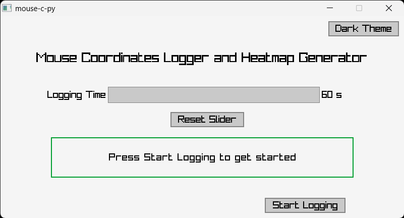
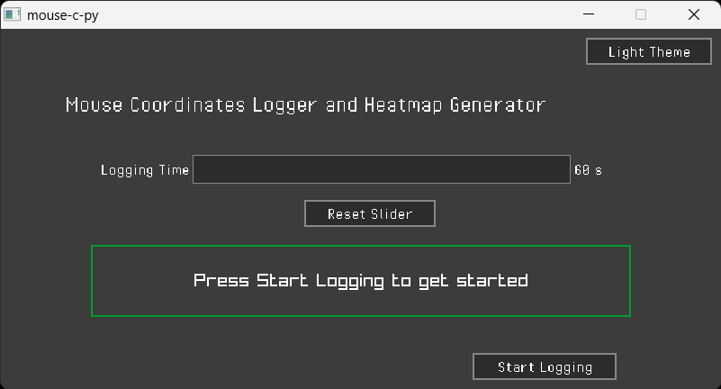
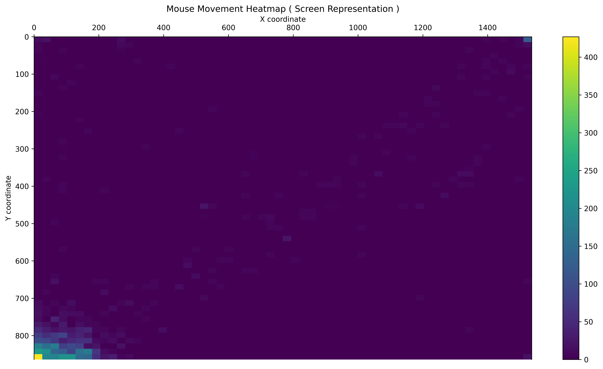
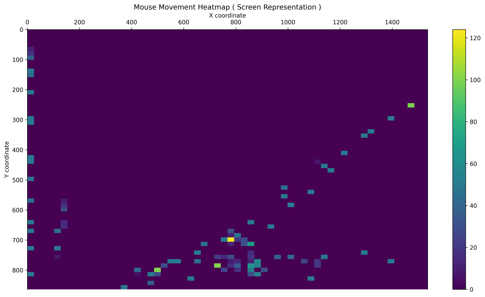

# mouse-c-py

> [!WARNING]
> This is a "*semi-failed*" project.
>
> It does work but "*we*" could not complete it because it requires so much in-depth knowledge our how the 'Win32' API works.

**Mouse logger** that generates a *heatmap image* based on the position of your mouse on the screen and a *barchart image* for the number of mouse-button presses.

- Heatmap Image Example:


- Barchart Image Example:


The program(s) uses **[raw input](https://ph3at.github.io/posts/Windows-Input/)** to get the data from the input device ( *mouse, touchpad, pen tablet, etc* ) and uses `GetCursorPos` to get the actual coordinates *under* the cursor whereby these coordinates are written to a [CSV](https://en.wikipedia.org/wiki/Comma-separated_values) file.

> This is the first ever project that has two programming languages involved!

---

# Backstory

---

# Usage

If you are a *non-technical* person then you are in the right place. Do follow the steps below and you should be able to use this *project*.

- Head to the [releases](https://github.com/Sunhaloo/mouse-c-py/releases) and **download** both the `program.exe` and `graphs.exe` executable files
- Simply run ( *by double clicking* ) the `program.exe` file and start *using* your mouse
- After about 1 minute, you should see that the `program.exe` closes
- The heatmap and barchart `.png` files should appear in your `~/Downloads` folder.

> [!IMPORTANT]
> These two `program.exe` and `graphs.exe` should be found in the **same** folder as `program.exe` calls ( `CreateProcessW` ) `graphs.exe`.

# Developing For mouse-c-py

> If you want to help me solve my issues that I am having with the introduction of the GUI.

## Requirements

- Windows Machine ( *preferably Windows 11* )
- [MYSYS](https://www.msys2.org/): GCC and Make
- Python ( *Version 3.14.2 or above* )
  - Python Package Manager: [`pip`](https://github.com/pypa/pip) or [`uv`](https://github.com/astral-sh/uv)

## Building / Compiling and Running

### C File

For our `main.c` file, you should simply run the `make` and the `Makefile` file has everything in there to compile the program

> [!NOTE]
> Given that I program mainly in Python; whereby a simple `python main.py` will run the file.
>
> I try to mimic this workflow by making a `program` *target* whereby I can simply run `make program` and its going to:
>
> 1. Compile the program
> 2. Run the `program.exe` file
> 3. Delete `program.exe`
>
> > Basically `program` target is acting as a group *target* for the `compile`, `run` and `clean` *targets*.
>
> Nevertheless, running `make` will only **compile** our `main.c` file.

### Python File

For our Python heatmap and barchart image generation is going involve a bit more step to be able to create the `graphs.exe` file.

- Create a Python virtual environment
- Copy our `main.py` file to the virtual environment created
- Install all the required modules / packages with `requirements.txt` file included in the repository
- Run the `pyinstaller` command to build the *executable file* from

This is the following `pyinstaller` command that I use to for building the `graphs.exe` file:

```bash
# pyinstaller command to compile the `graphs.exe` file
pyinstaller --onefile `
--clean `
--name graphs `
--hidden-import matplotlib.backends.backend_agg `
--exclude-module tkinter `
--exclude-module tcl `
--exclude-module _tkinter `
--exclude-module sqlite3 `
--exclude-module IPython `
--exclude-module jedi `
--exclude-module matplotlib.tests `
--exclude-module numpy.tests `
--exclude-module matplotlib.backends.backend_tkagg `
--exclude-module matplotlib.backends.backend_qt5agg `
--exclude-module matplotlib.backends.backend_pdf `
--exclude-module matplotlib.backends.backend_ps `
--exclude-module matplotlib.backends.backend_svg `
--exclude-module matplotlib.backends.backend_webagg `
--exclude-module notebook `
--exclude-module scipy `
--exclude-module xmlrpc `
--exclude-module email `
--exclude-module http `
--exclude-module PyQt5 `
--exclude-module PyQt6 `
--exclude-module PySide2 `
--exclude-module PySide6 `
main.py
```

> BTW I expect you to know how to create Python virtual environments and *such and such*.

> [!CAUTION]
> If you are really going to develop for this project...
>
> Do **NOT** push the Python virtual environment `venv` folder!
>
> The main reason as to why we **never** push a virtual environment to the GitHub repository are because:
>
> 1. They contains many, many files and therefore results in taking up a large space
> 2. Platform specific ( *in my specific 'Windows' case* )
>
> Nevertheless, I have already catered for that in my `.gitignore` file.

---

> [!NOTE]
> The *usage* and *development* are the same in all the other version that you see on the GitHub repository.

---

# The Different Versions

# v0.1.0

This was the first initial version learning about Window's 'Win32' API and trying to get started with the project.

Consider this version as a proof-of-concept of type of thing as I did not really know what I was doing and was constantly learning with YouTube videos, articles and Claude.

# v0.2.0

Now, this version is basically doing improvements to our `v0.1.0` codes.

We improved the `main.c` and `main.py` codes; mainly working on the Python side of things. I learned about the `--exclude-module` flag for `pyinstaller` and this did reduce the size of our `graphs.exe` file.

# v0.3.0

> This is where the failure comes in!

Since the beginning of this project, I want to "*taste" [raylib](https://github.com/raysan5/raylib/) and [raygui](https://github.com/raysan5/raygui). And hence, I saw this as a great opportunity to actually learn about it as this project would really be *complete* with a GUI program.

- GUI Frontend made using raylib and raygui:





So given in this project I learned to use a lot of technologies like `matplotlib` and raylib, etc. I went on a lot of "*side-projects*" in order to them bring them all together to make it work at the end.

So for the GUI, the structure and placement of the objects inside the window was all done by me and it was pretty easy once I actually understood about '[immediate-mode-gui](https://en.wikipedia.org/wiki/Immediate_mode_(computer_graphics))'.

> How we do our updates inside the `while` loop compared to how we usually do it in separate function.

But in life, once you fix something, another thing breaks. So given that I managed to make the `main.c` file with the help of Claude and my `gui.c` file pretty much by myself ( *again the structure only* )

> I needed Claude to see my GUI first so that it know what needs to be done in order to make it functional

I asked Claude to basically combine both of them. What a head-ache that was as I got a lot of conflicts with `windows.h` because of the `Rectangle` *struct* and many more trouble.

Therefore, we decided that instead of trying to mix them up. We should simply let the `gui.c` be its own file and make a `win32_input.h` and `win32_input.c` and then call specific functions depending on the button pressed by the user.

> **And the mouse logging, gathering of the coordinates part started to fail miserably**

- `v0.2.0`:



- `v0.3.0`:



> [!NOTE]
> In both test, I placed my mouse at the **bottom-left** corner near the *Start* button ( *occasionally going to top-right corner* )  but the `v0.3.0` resulted in a complete mess as you can see above.
>
> But the issue was **only** for the mouse coordinates part and **not** for the *button presses*!

I originally thought it could be the `graphs.exe` file but then I downloaded `v0.2.0`'s `graphs.exe` and place it in my coding setup and the issue persisted!

> [!TIP]
> That is why we need to learn to actually code, code so that when shit goes down we know what to fix.
>
> None of this "*vibe-coding*" bullshit!
